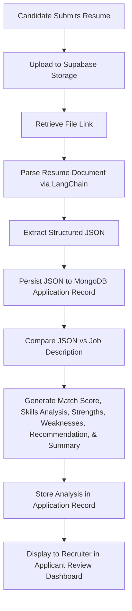
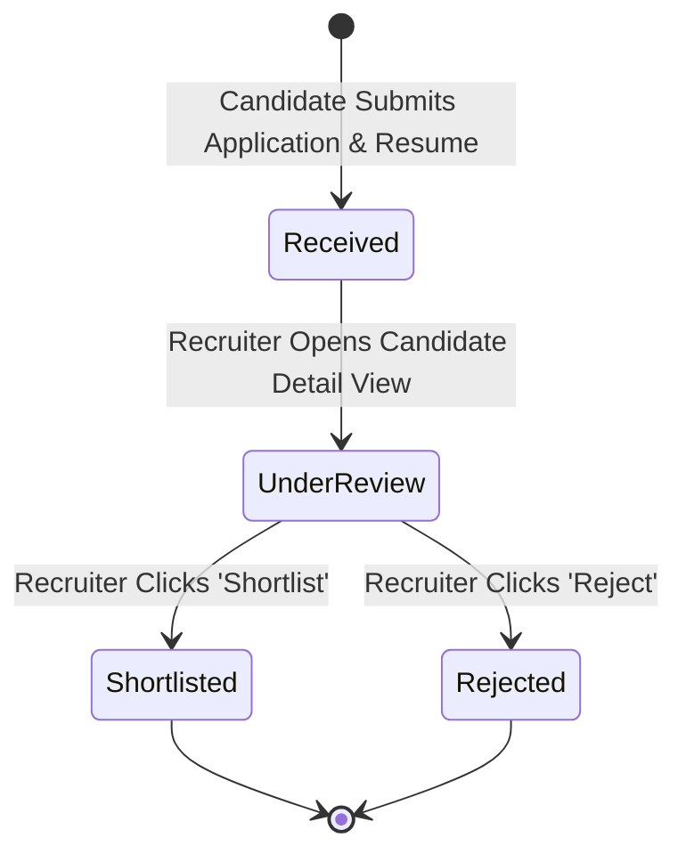

# Product Specification

This document details the functional specifications for the RecruitIQ Minimum Viable Product (MVP). It translates the business objectives and technical requirements into concrete software modules, feature behaviors, and user workflows. 

The specification defines exactly how the system behaves, the logical transitions of data, and the criteria for successful execution. Implementation details, such as database collections, schema designs, and specific API routing schemas, are omitted here and reside in their respective architectural documents.

---

## System Architecture and User Partitioning

RecruitIQ enforces a strict separation between its two supported user roles. 

### Identity Partitioning

The system maintains two completely distinct user domains:
- **Candidate Domain:** Governs job seekers, their profiles, and their job applications.
- **Recruiter Domain:** Governs recruitment managers, company profiles, job listings, and application evaluations.

There is no shared user database collection or polymorphic account type. Candidates and recruiters register, authenticate, and exist as independent database entities. An email address registered under the Candidate domain can be registered under the Recruiter domain without namespace conflicts. Session contexts, access tokens, and JWT payloads explicitly encode these roles to prevent cross-domain privilege escalation.

---

## Module Specifications

The RecruitIQ MVP is divided into four functional modules: Authentication Module, Candidate Workspace Module, Recruiter Workspace Module, and the Artificial Intelligence Pipeline.

### 1. Authentication Module

The Authentication Module provides secure access control and identity validation.

#### Candidate Registration and Authentication
Candidates register by providing their email address, password, and basic profile fields. Upon submission, the system validates input formats, hashes the password using bcrypt, and persists the record to the Candidate database. Candidates authenticate using their email and password. A successful login generates a JWT signed with the system secret key, which is returned in the response payload.

#### Recruiter Registration and Authentication
Recruiters register by providing their email address, password, and initial company association details. Password hashing and persistence mirror the Candidate flow but targets the Recruiter database. Recruiters authenticate using their email and password, receiving a JWT containing recruiter scope authorization.

#### Session Lifecycle
Sessions are stateless, managed via JWT payloads stored in client-side storage. The token is appended to the authorization header of every outgoing Axios request. Session expiration is handled on both client and server: the client forces a logout when the token expires, and the server validates token signatures on every protected endpoint.

### 2. Candidate Workspace Module

The Candidate Workspace Module manages the job seeker lifecycle from profile creation to application monitoring.

#### Profile Management
Upon initial login, the candidate is directed to complete their profile. The profile screen collects personal information, contact information, structured experience (previous roles, companies, dates), educational background (institutions, degrees), and technical or professional skills. This information is saved to the candidate's profile record and forms the default profile metadata.

#### Job Board
The candidate homepage lists all published job openings. The interface supports simple list browsing. Selecting a job opens the Job Detail View, displaying the job title, department, location, employment type, salary range, description, and structured requirements list.

#### Application Submission
From the Job Detail View, candidates apply by clicking the Apply button. The application form requires the candidate to upload a resume file. 

The resume upload behaves as follows:
- The candidate selects a file from their local file system.
- The interface validates the file format (PDF or DOCX only) and file size (under 10MB).
- The file is transmitted to the backend, which uploads the asset directly to Supabase Storage.
- Once stored, the backend creates an Application record associating the Candidate ID, Job ID, and the Supabase Storage URL of the resume.
- The application status is set to a default state of "Received".

Candidates are prevented from applying to the same job twice; the interface disables the apply action if a previous application record exists for the current user and job combination.

#### Application Status Tracking
Candidates access a private dashboard listing their active and past applications. Each entry displays the job title, company name, date applied, and the current status. The status values transition from "Received" to "Under Review", and finally to either "Shortlisted" or "Rejected" based on recruiter actions.

### 3. Recruiter Workspace Module

The Recruiter Workspace Module governs job requisition management and candidate evaluation tools.

#### Company Profile Setup
After registering, the recruiter completes a company profile, capturing the company name, logo placeholder, website URL, and descriptive profile text. This metadata is appended to all job listings created by this recruiter's organization.

#### Job Requisition Management
Recruiters create job listings using a structured form capturing title, department, location, employment type, salary range, description, and requirements. The recruiter can publish, edit, or delete job requisitions:
- **Publish:** Makes the listing visible on the Candidate Job Board.
- **Edit:** Updates the requisition fields; modifications reflect instantly on the public job board.
- **Delete:** Removes the job posting from active listings. Associated candidate applications are retained in a read-only state for candidates to track historic application progress, but no new applications can be accepted.

#### AI Assisted Job Description Generation
While creating a job requisition, recruiters can generate a job description using AI:
- The recruiter enters basic inputs: Title, Key Responsibilities (comma-separated), and Required Skills/Tools.
- The recruiter clicks "Generate". The system sends the criteria to the AI Pipeline.
- The generated structured description is returned and populated in the form editor.
- The recruiter reviews, edits the text, and commits it to the job posting.

#### Applicant Review Dashboard
The recruiter's primary landing page list all active job requisitions. Selecting a job opens the Applicant Review Dashboard for that specific requisition. The dashboard presents a tabular list of all applicants.

The dashboard provides:
- Candidate Name, Application Date, and Current Status.
- The AI-generated Matching Score (0-100%).
- Actions to transition candidate status: "Move to Under Review", "Shortlist", or "Reject".

Selecting a candidate's row loads the Candidate Detail View. This view renders the original candidate profile, a link to open the uploaded resume PDF/DOCX, and the comprehensive AI Analysis panel.

### 4. Artificial Intelligence Pipeline

The AI Pipeline is an asynchronous backend service triggered during application submission and job creation. It acts exclusively as a decision-support layer.

#### Resume Parsing and Extraction
Upon application submission, the backend triggers the LangChain pipeline to parse the uploaded resume file. LangChain extracts plain text from the document and passes it to the Groq inference engine with a structured schema prompt. The engine extracts candidate info, professional skills, employment history, and education history. The resulting structured JSON object is validated and stored in the database.

#### Candidate vs Job Matching Analysis
The system retrieves the extracted resume JSON and the corresponding job description. Both inputs are sent to the Groq model using a precise evaluation prompt template. The engine performs contextual semantic matching and returns a structured analysis containing:
- **Overall Matching Score:** A numeric value between 0 and 100 representing qualifications alignment.
- **Matching Skills:** A list of skills present in both the resume and the job description.
- **Missing Skills:** A list of critical skills specified in the job description but absent from the resume.
- **Strengths:** A bulleted text summary of the candidate's strong alignment points.
- **Weaknesses:** An objective summary of areas where the candidate falls short of the job requirements.
- **Recommendation:** A semantic recommendation statement (e.g., strong candidate, marginal candidate, mismatch).
- **Summary:** A concise paragraph summarizing the candidate's career narrative and overall fit.

This analysis payload is saved directly to the Application record and rendered within the recruiter's candidate review panel. If the AI pipeline fails, the application completes with empty analysis fields, allowing manual screening to continue.

---

## Workflows and Lifecycle State Machines

### Application Lifecycle State Machine

The following diagram illustrates the states a candidate's application passes through from initial submission to final determination:

---

## Future Enhancements (Out of Scope for MVP)

The following capabilities are excluded from the RecruitIQ MVP and are deferred to future development phases:
- **Admin Portal:** Global administrative tools to monitor platform utilization and manage system tenants.
- **Messaging and Collaboration:** Chat modules allowing recruiters to interact with candidates or share feedback internally.
- **Interview Scheduler:** Direct integration with calendars to coordinate interview bookings.
- **Saved Jobs & Resume Builder:** Candidate-facing tools to save listings for later and build resumes online.
- **Email Automation:** Automated transactional emails for status updates or interview invitations.
- **Analytics Dashboards:** Aggregated reporting on time-to-hire, funnel conversion, and sourcing efficiency.
