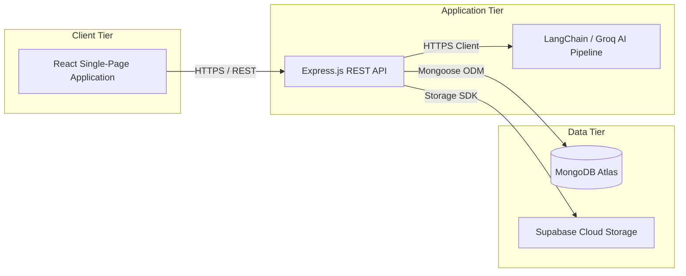
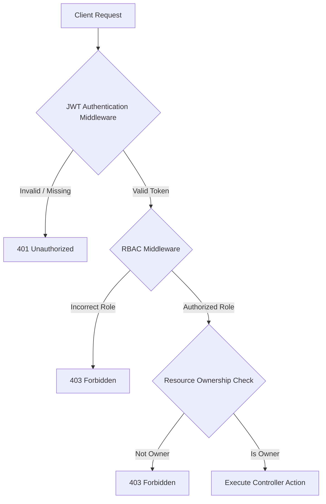

# System Architecture

This document describes the high-level system architecture and component design for RecruitIQ. It details the structural patterns, interface boundaries, data flow routes, and deployment topography of the platform.

The architectural design enforces strict physical and logical partitioning of concerns, optimized for simplicity, scalability, and predictable operational costs at small-to-medium scale.

---

## Architectural Topography

RecruitIQ utilizes a decoupled, three-tier application architecture consisting of a single-page frontend application, a stateless RESTful backend API service, and a managed database/storage layer.

The system components interact via standard HTTP protocols. There is no shared execution space or server-side rendering. The client interacts with application services exclusively through exposed API endpoints.

---

## Tier Definitions

### 1. Client Tier (Frontend)

The frontend is a single-page application built on React 19, Vite, and TypeScript. It is responsible for rendering the user interface, managing local application state, capturing user inputs, and presenting outputs returned from the API tier.

The client architecture is organized around the following principles:
- **Stateless Views:** Components render based on props and server state managed by TanStack Query.
- **Form Integrity:** User forms use React Hook Form with schemas defined via Zod to enforce type-safe validation before API dispatch.
- **Modular Layouts:** Separate routes are mapped through React Router DOM to split candidate and recruiter experiences.

### 2. Application Tier (Backend)

The backend is a stateless REST API built on Node.js and Express.js using strict TypeScript. It hosts the business logic, handles user authentication, coordinates document uploads, and acts as the gatekeeper to the storage and database tiers.

The backend architecture consists of the following components:
- **Router Layer:** Maps incoming requests to controller actions based on URI paths and HTTP methods.
- **Middleware Layer:** Intercepts incoming requests to perform JWT authentication, role verification, payload validation, and multipart file processing (via Multer).
- **Controller Layer:** Orchestrates the request-response lifecycle, unpacking incoming inputs and dispatching work to the service layer.
- **Service Layer:** Houses the core business logic, transactional validations, and integrations. The service layer is isolated from HTTP concerns and database configuration details.
- **AI Service Pipeline:** A module within the service layer utilizing LangChain and Groq. It parses resumes and evaluates qualifications against job descriptions.

### 3. Data Tier (Persistence & Storage)

The data tier is split into structured document storage and unstructured binary asset storage:
- **Structured Data (MongoDB Atlas):** Stores JSON documents representing Candidates, Recruiters, Job Requisitions, and Applications (incorporating parsed resume metadata and AI evaluation scores). Object Document Mapping (ODM) is handled using Mongoose.
- **Unstructured Storage (Supabase Storage):** Houses raw PDF and DOCX resume documents. The application backend uploads files directly to Supabase buckets using the Supabase SDK and stores the resulting read-only URLs in the MongoDB database records.

---

## Security Architecture

### Authentication Lifecycle
Security is established at the interface boundary through JSON Web Tokens (JWT) signed with an HS256 key defined in the server's environment settings. The client stores this token in browser memory or local storage and includes it in the `Authorization: Bearer <token>` header of subsequent API requests.

### Role-Based Access Control (RBAC)
The backend enforces strict route security by verifying the role metadata encoded in the validated JWT payload. Specific endpoints are bound to middleware that restricts execution to either the `Candidate` or `Recruiter` roles.

### Resource Boundary Verification
In addition to role check middleware, services verify resource ownership. When a recruiter requests applications for a job ID, or attempts to edit a job description, the service checks that the target resource's creator ID matches the requester's authenticated ID.

---

## AI Pipeline Data Integration

The AI parsing and matching workflow is decoupled from client interactions to prevent request timeouts.

The integration sequence behaves as follows:
1. The candidate client submits a multipart form request containing the resume file.
2. The Express endpoint receives the request, stores the binary in memory temporarily, and streams it to Supabase Storage.
3. Once the file is written, the storage URL is generated.
4. The service invokes the LangChain extractor. The extractor reads the file content and sends structured schema prompts to the Groq API.
5. The extracted structured profile is stored directly in the database.
6. The matching evaluation service is executed comparing the extracted JSON with the active Job description document.
7. The complete evaluation payload is written to the database, marking the application as processed.
8. When the recruiter dashboard queries the candidate, the structured evaluation is returned from the local database, eliminating real-time AI API overhead on dashboard views.

---

## Deployment Architecture

The physical deployment architecture maps components to specialized cloud hosts to simplify maintenance and scale without configuration overhead.

The React frontend single-page application is deployed to Vercel, utilising its Edge Network to cache and deliver static assets globally with minimal latency.

The backend Express REST API is hosted on Render within a managed Node.js container environment. This setup allows horizontal scaling to accommodate changes in traffic volume.

The persistence layers utilize managed cloud infrastructure: database operations run on MongoDB Atlas within a multi-region cluster to ensure high availability, and uploaded files are stored in Supabase Storage, an S3-compatible elastically scaled bucket system.
