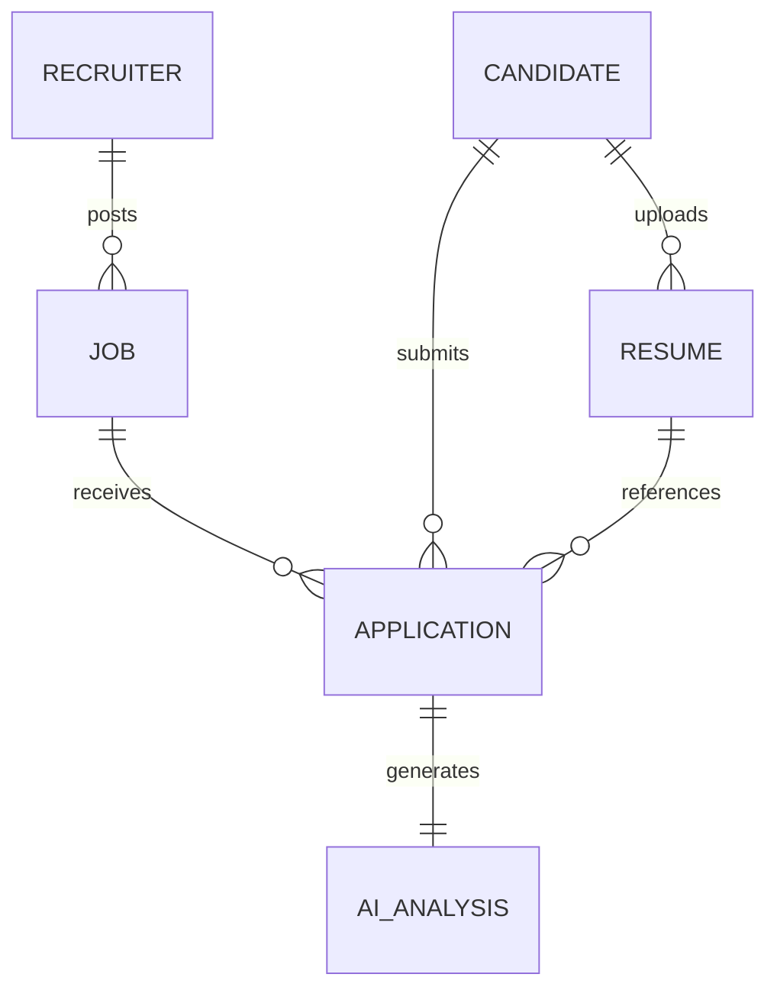

# Database Design

This document describes the database design for the RecruitIQ Applicant Tracking System. It details the persistence layer architecture, the schema blueprints, relationship cardinalities, validation mechanisms, and query-optimization structures of the database.

The design relies on MongoDB Atlas as the managed database host, utilizing the Mongoose Object Document Mapper (ODM) to interact with the persistence layer from the Node.js application tier.

---

## Architecture and Database Selection Rationale

RecruitIQ uses MongoDB for data persistence. This decision is based on three engineering requirements:

- **JSON Document Alignment:** The AI Pipeline parses resumes and outputs structured JSON schemas. MongoDB's native support for BSON documents allows the system to store, query, and index these complex, nested objects (such as `parsedData` in the Resume collection) without flattening or schema translation.
- **Dynamic Requisition Requirements:** Job postings and candidate qualifications vary widely. Document-based schemas allow the `Job` and `Resume` collections to scale structurally without requiring migration scripts or database downtime.
- **Scalability and Operations:** Using MongoDB Atlas provides automated multi-region scaling, integrated backup strategies, and search index configurations, minimizing operational overhead for small-to-medium deployment footprints.

---

## Data Model Partitioning

The system implements a divided actor model. Candidates and recruiters represent two distinct domains with separate validation rules, credentials, and data structures.

To enforce security boundaries, there is no shared user collection. Candidate data is stored in the `Candidate` collection, and recruiter data is stored in the `Recruiter` collection. This design ensures that:
- Account authentication checks query distinct tables, preventing access tokens from cross-role activation.
- The schema requirements for candidates (educational history, links, portfolios) do not clutter the administrative metadata required for recruiters (company size, industry, logo attributes).

---

## Collection Architecture

The database architecture is defined by six distinct collections:

### 1. Recruiter Collection
- **Responsibility:** Manages agency or company personnel profiles, authentication credentials, and corporate branding information.
- **Primary Key:** `_id` (ObjectId)
- **Relationships:** One-to-Many with the `Job` collection.

### 2. Candidate Collection
- **Responsibility:** Manages job seeker personal details, credentials, and professional contact links.
- **Primary Key:** `_id` (ObjectId)
- **Relationships:** One-to-Many with the `Resume` collection; One-to-Many with the `Application` collection.

### 3. Job Collection
- **Responsibility:** Details the hiring parameters, prerequisites, and description of open requisitions.
- **Primary Key:** `_id` (ObjectId)
- **Relationships:** Many-to-One with the `Recruiter` collection; One-to-Many with the `Application` collection.

### 4. Resume Collection
- **Responsibility:** Retains reference paths to binary resume documents stored in Supabase Storage, alongside the extracted text and structured JSON data generated by the AI parsing pipeline.
- **Primary Key:** `_id` (ObjectId)
- **Relationships:** Many-to-One with the `Candidate` collection; One-to-Many with the `Application` collection.

### 5. Application Collection
- **Responsibility:** Tracks the connection between a specific Candidate, Job, and Resume, documenting the lifecycle phase of the evaluation.
- **Primary Key:** `_id` (ObjectId)
- **Relationships:** Many-to-One with `Candidate`, `Job`, and `Resume`; One-to-One with the `AIAnalysis` collection.

### 6. AIAnalysis Collection
- **Responsibility:** Records the structured performance indicators, strengths, gaps, and recommendations evaluated by the LLM matching pipeline.
- **Primary Key:** `_id` (ObjectId)
- **Relationships:** One-to-One with the `Application` collection.

---

## Normalized Relationships and Reference Strategy

The system uses normalized references (via MongoDB ObjectIds) rather than document embedding for major entity boundaries. This strategy is selected for specific reasons:

### Recruiter (1) → (N) Job
Requisitions are queried independently of recruiters. Candidates search jobs without loading recruiter metadata beyond the company name. Storing jobs in a separate collection prevents the recruiter document from growing beyond the 16MB BSON limit as the organization publishes new listings.

### Job (1) → (N) Application
An application is a high-frequency transactional document. Separating applications from jobs allows the system to query, filter, and paginate applications on the recruiter dashboard without loading the entire parent job description.

### Candidate (1) → (N) Resume
Candidates can maintain multiple resumes (such as separate versions for different roles or updated formats). Storing resumes in a separate collection ensures that candidate profile queries remain highly performant, loading parsed text payloads and binary paths only when a resume needs to be viewed or parsed.

### Candidate (1) → (N) Application
Applications represent transactional links. Separating them allows candidates to view their application history on their status board via simple index lookups on the `candidateId` foreign key.

### Resume (1) → (N) Application
A single resume can be submitted to multiple applications. Storing the reference rather than copying the parsed data prevents synchronization issues and minimizes database size.

### Application (1) → (1) AIAnalysis
AI evaluations are stored in a dedicated collection. This partition allows the system to load application summaries rapidly in recruiter dashboard grids without pulling down large string fields like strengths, weaknesses, and LLM text summaries until the detailed view is requested.

---

## Validation Strategy

Mongoose handles data validation at the application boundary, executing rules before the database driver dispatches write commands:

- **String Constraints:** Fields like `email` utilize lowercase normalizers and strict regex checks. Text columns like `password` enforce minimum complexity lengths.
- **Enumerated Lists:** Status fields are bound to strict value constraints:
  - `Job.status`: Restricted to `Open` or `Closed`.
  - `Application.status`: Restricted to `Received`, `Under Review`, `Shortlisted`, or `Rejected`.
- **Unique Indexes:** Email fields in both the `Candidate` and `Recruiter` collections enforce unique constraints at the database level to prevent duplicate registration collisions.
- **Array Limits:** Skills arrays and requirements list fields enforce type validation on child elements, ensuring only string elements are written to the database.

---

## Indexing Strategy

To support performant query execution at scale, the database defines the following compound and unique indexes:

### Candidate and Recruiter Lookup
- **Unique Single Index:** `Candidate.email` (Ascending)
- **Unique Single Index:** `Recruiter.email` (Ascending)
  *Rationale:* Fast identity lookup during registration and login routines.

### Job Queries
- **Single Field Index:** `Job.recruiterId` (Ascending)
  *Rationale:* Optimizes the recruiter dashboard when retrieving requisitions posted by the authenticated session.
- **Compound Index:** `Job.status` (Ascending) + `Job.createdAt` (Descending)
  *Rationale:* Speeds up the candidate job board when loading open job listings ordered by publish date.

### Application Processing
- **Compound Index:** `Application.jobId` (Ascending) + `Application.status` (Ascending)
  *Rationale:* Optimizes sorting and filtering on the recruiter dashboard when reviewing candidates in specific stages.
- **Single Field Index:** `Application.candidateId` (Ascending)
  *Rationale:* Optimizes loading the candidate's personal application history status board.

### AI Analysis Lookup
- **Unique Single Index:** `AIAnalysis.applicationId` (Ascending)
  *Rationale:* Enforces the One-to-One structural relationship and speeds up retrieval of evaluations when displaying applicant detail panels.

---

## Security and Integrity Protocols

- **Password Storage:** All passwords must be hashed using bcrypt on the backend server before reaching the persistence layer. Mongoose hooks are used to verify that passwords are only re-hashed if modified.
- **Automatic Timestamps:** Every schema utilizes Mongoose's native timestamp support, automatically managing `createdAt` and `updatedAt` datetime entries to provide reliable audit records.
- **Orphan Prevention:** Deleting a Candidate, Job, or Resume raises reference integrity dependencies. The application layer checks for active references to prevent dangling foreign keys. If a job is closed or deleted, the associated applications retain their historical relations in a read-only state.
- **Network Isolation:** MongoDB Atlas is configured to reject all connections except those coming from the whitelisted IP addresses of the application containers on Render and local development machines.
