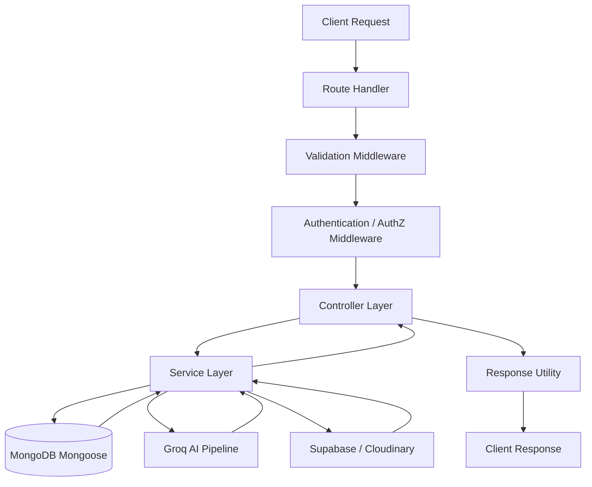
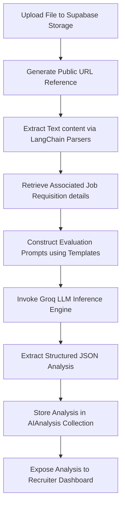
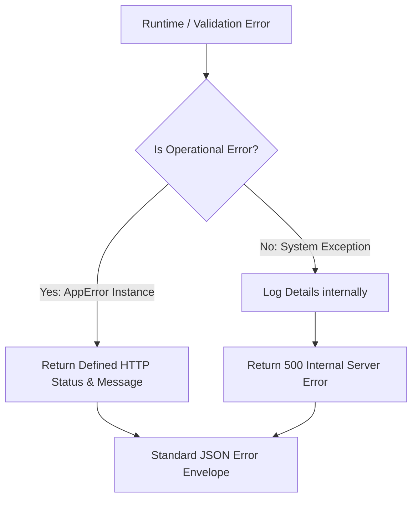

# Backend Architecture

This document details the backend application architecture, design patterns, service layer organization, and request processing mechanisms for the RecruitIQ platform. 

The backend service is a stateless REST API built on Node.js and Express.js using strict TypeScript. It serves as the transaction processor, database controller, file-upload manager, and artificial intelligence coordinator for the application.

---

## 1. Introduction

### Purpose of the Backend
The RecruitIQ backend functions as the secure business-logic core of the application. It coordinates incoming traffic from the React frontend, validates data consistency, manages file assets, routes semantic prompts to LLM models, and enforces database transactions.

### Responsibilities
The service is responsible for:
*   **Authentication & Session Guards:** Parsing, signing, and validating JWT authentication tokens.
*   **Input Validation:** Enforcing strict schemas at the entry boundary.
*   **Binary Data Pipeline:** Storing candidates' resumes in cloud storage and retrieving assets.
*   **AI Orchestration:** Executing resume parsing and matching-evaluation routines.
*   **Transactional Persistence:** Interacting with MongoDB via Object Document Mapping (ODM).
*   **Centralized Error Management:** Mapping internal runtime failures to standard HTTP responses.

### Backend Goals
*   **Scalability:** Decoupled execution flows that support high concurrent traffic and scaling components.
*   **Maintainability:** Clean separation of concerns where database schemas, routing logic, validation layers, and LLM integrations are isolated.
*   **Security:** Multi-layered access guards enforcing Role-Based Access Control (RBAC) and resource ownership validation.

### Clean Architecture Principles
The system follows Clean Architecture principles by separating the transportation layer (HTTP routes and controllers) from the core domain business rules (services and models). 
*   **Decoupled Entities:** Services implement business rules without direct dependency on the Express router framework.
*   **Dependency Direction:** Inward-facing layers (models and business rules) are independent of external frameworks (Express, Multer, or external cloud SDKs).

---

## 2. Technology Stack

To satisfy performance and architectural goals, the backend utilizing the following technology selections:

### Core Runtime & Framework
*   **Node.js:** An event-driven, non-blocking I/O JavaScript runtime, selected for its high concurrency support and rich ecosystem.
*   **Express.js:** A lightweight, unopinionated web framework, selected for route orchestration and request-pipeline middleware capabilities.
*   **TypeScript (Strict Mode):** Used to enforce static type-safety across all routes, controller payloads, service methods, and database structures. Compiles with strict flags enabled (`noImplicitAny`, `strictNullChecks`) to catch logic errors during compilation.

### Database & Persistence Layer
*   **MongoDB:** A document-oriented NoSQL database, selected because its document structure aligns natively with JSON data models, particularly the structured parsed outputs of the resume screening pipeline.
*   **Mongoose:** A schemas-based Object Document Mapper (ODM) for MongoDB. It provides validation hooks, schema models, and transaction management inside the application tier.

### Security & Cryptography
*   **JWT (JSON Web Tokens):** Used to manage stateless user session authorization. Encodes user identities and role scopes into cryptographically signed HS256 payloads.
*   **bcrypt:** A high-cost key-derivation hashing function, used to secure recruiter and candidate password credentials before persistence.

### Input Validation & Form Handlers
*   **Zod:** A TypeScript-first schema declaration and validation library, used to intercept malformed incoming body and query payloads at the router boundary.
*   **Multer:** A multipart form data middleware, used to extract incoming binary resume file uploads and stream them to memory buffers.

### Media & Cloud Storage
*   **Supabase Cloud Storage:** Elastic cloud storage buckets, used to host candidate resume documents (PDF and DOCX). The backend uploads files directly to Supabase using its SDK and stores public links in the database.
*   **Cloudinary:** A media asset manager, used for hosting and delivering corporate company logos and recruiter branding resources with optimized processing.

### Artificial Intelligence & Processing Pipeline
*   **LangChain:** A framework used to structure prompts, parse document segments, and manage memory chains for parsing tasks.
*   **Groq LLM:** High-speed inference engine powering LLM models (such as Llama-3), used to parse resumes and generate matching scores, strengths, and weakness summaries.
*   **Vector Database (Planned):** An index system (e.g., Pinecone/Chroma) planned for future phases to store and perform similarity searches on high-dimensional text embeddings generated from candidates' profiles and job postings.

### Operations & Tooling
*   **dotenv:** Environment configuration manager, securing keys, tokens, and database URIs outside the application logic.
*   **ESLint & Prettier:** Automated code analysis and formatting packages to enforce standard styling and lint rules.

---

## 3. Backend Folder Structure

The backend application is organized into a clean folder structure under the main `src/` directory to preserve modular boundaries:

```
src/
├── config/          # Global configurations (database, cloud SDK initializations)
├── controllers/     # HTTP request controllers (maps requests to service layers)
├── middleware/      # Router interceptors (auth checks, error catchers, upload limits)
├── models/          # Mongoose database schema definitions
├── routes/          # Express route definitions mapping URLs to controllers
├── services/        # Decoupled business logic (AI logic, calculations, DB queries)
├── validators/      # Zod validation schemas for request bodies
├── utils/           # Shared utility classes (error handlers, success response formatters)
├── types/           # Global TypeScript type overrides and interfaces
└── app.ts           # Express application initialization and server entry point
```

### Folder Responsibilities:
*   **`config/`**: Houses modules that initialize external services, such as the MongoDB Mongoose connection and Supabase/Cloudinary SDK configuration.
*   **`controllers/`**: Extracts parameters from HTTP requests (headers, parameters, query strings, bodies) and delegates tasks to services. Returns standardized HTTP JSON responses.
*   **`middleware/`**: Functions that execute sequentially prior to controllers, performing checks like token verification, role authentication, and error trapping.
*   **`models/`**: Defines schemas and registers Mongoose models. These define the database collections.
*   **`routes/`**: Registers endpoints and maps URLs to specific controllers, incorporating appropriate validation and authentication middleware.
*   **`services/`**: Houses all transactional operations and external API integrations (e.g., LangChain Groq connections). Services have no knowledge of Express requests or responses.
*   **`validators/`**: Contains schema blueprints that Zod uses to validate payloads.
*   **`utils/`**: Holds generic utilities, such as customized exception sub-classes (`AppError`) and response normalizers.
*   **`types/`**: Declares global interfaces and extensions, such as extending Express's `Request` interface to support custom properties like `req.user`.

---

## 4. Layered Architecture

The application implements a layered architecture to keep components separated and modular. The request flow passes through the following layers:



### Layer Responsibilities:
1.  **Route Handler:** Identifies the request URL, HTTP verb, and runs matching middlewares.
2.  **Validation Middleware:** Runs Zod schemas against `req.body` or `req.query`. If validation fails, it aborts early and returns a `400 Bad Request`.
3.  **Authentication/Authorization:** Verifies the JWT signature. Checks that the user holds the required role (`Candidate` or `Recruiter`) and passes ownership checks.
4.  **Controller Layer:** Acts as an orchestrator. Unpacks payload data and invokes one or more services.
5.  **Service Layer:** Implements core business logic. Interacts with database models and AI parsing tools.
6.  **Database / AI Services:** Resolves queries on MongoDB, runs LLM models, and interacts with cloud storage.
7.  **Response Utility:** Packages output data into standard success envelopes.

---

## 5. Request Lifecycle

The lifecycle of a single incoming request on the backend is structured as follows:

1.  **Request Received:** The HTTP payload hits the Node.js server. Express routes the request to the matching endpoint.
2.  **Validation:** Zod schemas intercept the payload, checking types, formats, and required inputs. If validation fails, it throws a validation exception caught by the error handler.
3.  **Authentication:** The authorization middleware extracts the JWT from the `Authorization: Bearer <token>` header. It decodes the token payload and binds the verified user object to `req.user`.
4.  **Authorization:** Role middleware checks if the user's role satisfies the endpoint permissions. Ownership checking middleware verifies that resource IDs (e.g., `jobId` or `applicationId`) belong to the requesting user.
5.  **Business Logic Execution:** The controller receives the request context and invokes the service layer.
6.  **Database Interaction:** The service layer queries the MongoDB cluster via Mongoose ODM models.
7.  **AI Interaction (When Applicable):** For application reviews or resume uploads, the service invokes the LangChain pipeline, extracts structured resume data, sends prompts to the Groq LLM, and retrieves evaluation results.
8.  **Response Formatting:** The controller receives the raw outcome, formats it via the standard success envelope utility, and returns a JSON payload.
9.  **Error Handling:** If an error occurs at any step, the promise catches the exception and forwards it to the global error middleware, which compiles a structured JSON error response.

---

## 6. Authentication & Authorization

### JWT Authentication
Sessions are managed statelessly. The token contains the user's ID, email, and role, signed with an HS256 secret. It is valid for a set duration, after which the client must authenticate again.

### Password Hashing using bcrypt
During recruiter or candidate registration, passwords undergo one-way hashing with a cost factor (salt rounds) of 12 before being stored. Plain text credentials never reach the database. During login, `bcrypt.compare` verifies the input against the stored hash.

### Protected Routes
Protected routes are guarded by a authentication middleware. If the token is missing, expired, or carries an invalid signature, the request is blocked and a `410 Unauthorized` response is returned.

### Role-Based Access Control (RBAC)
Role verification middleware checks token payloads to enforce restrictions:
*   **Recruiter Access:** Restricts access to routes such as job posting creation (`POST /jobs`), job updating (`PATCH /jobs/:jobId`), application evaluations, and AI evaluations.
*   **Candidate Access:** Restricts access to resume parsing uploads (`POST /resumes`) and job application submissions (`POST /applications`).
*   **Public Routes:** Allows unauthenticated queries for job listings (`GET /jobs`) and detailed job descriptions (`GET /jobs/:jobId`), enabling search engines and candidates to browse open positions.

---

## 7. Database Architecture

The backend interacts with MongoDB via the Mongoose ODM layer. Data relationships are normalized rather than nested to optimize index performance.

### Collection Mappings
The database layer defines six distinct models:
*   **Recruiter:** Stores email, hashed password, company profile information, and branding assets.
*   **Candidate:** Stores email, hashed password, personal profile information, skills, and work history.
*   **Job:** Stores requisition titles, locations, descriptions, qualifications, and the posting recruiter's ID.
*   **Resume:** Stores candidate references, Supabase storage URLs, raw text, and structured JSON parsing outputs.
*   **Application:** Connects a Candidate, Job, and Resume to document the evaluation status.
*   **AIAnalysis:** Connects to an Application in a One-to-One relationship to hold matching scores and semantic strengths/weaknesses.

> [!NOTE]
> For complete specifications, collection blueprints, indexes, validation parameters, and entity relationship diagrams, refer to [Database Design](file:///Users/jinay/Desktop/Workspace/MERN%20Full%20Stack/RecruitIQ/docs/06_Database_Design.md).

---

## 8. AI Integration Architecture

The AI pipeline is designed to convert unstructured resume documents into structured evaluation records without introducing blocking delays for client interfaces.

The parsing and evaluation pipeline operates through the following stages:



### Pipeline Steps:
1.  **Resume Upload:** The candidate uploads a PDF/DOCX file. The application uploads it to Supabase Storage and returns its public URL.
2.  **Text Extraction:** The backend reads the document text content via LangChain parser libraries.
3.  **Job Description Retrieval:** The system retrieves the job posting description and requirements from MongoDB.
4.  **Prompt Construction:** The service injects the candidate's parsed resume JSON and job requirements into an evaluation template prompt.
5.  **LLM Processing (Groq):** The compiled prompt is sent to the Groq inference engine.
6.  **Structured Analysis:** The LLM returns a structured JSON payload containing matching score metrics (0-100), matching skills, missing skills, strengths, weaknesses, recommendation, and a summary.
7.  **AIAnalysis Collection:** The backend persists the analysis to the `AIAnalysis` collection, linking it to the parent `Application` record.
8.  **Frontend View:** The recruiter detail dashboard retrieves the analysis record directly from the database without any real-time processing overhead.

---

## 9. Error Handling Strategy

The backend uses a centralized error-handling strategy to capture and process exceptions consistently.



### Components:
*   **Centralized Error Middleware (`errorHandler`):** Intercepts all unhandled errors thrown inside routes. It determines the error type, formats the payload according to the standard envelope, and sends the response.
*   **`AppError` Helper Class:** A custom class extending JavaScript's `Error`. It models operational exceptions (such as validation, authentication, or resource-not-found errors) and attaches an HTTP status code.
*   **`asyncHandler` Wrapper:** A utility function that wraps asynchronous controller functions. It catches rejected promises and forwards them to the Express `next()` function, removing the need for repetitive `try-catch` blocks in controllers.

### Standard Response Mapping:
*   **Validation Errors (Zod):** Caught and translated to `400 Bad Request` with field-level details.
*   **Authentication Errors:** Invalid or expired tokens return `401 Unauthorized`.
*   **Database Errors:** Unique index collisions (like duplicate emails) return `400 Bad Request`.
*   **Unexpected Exceptions:** Unhandled application errors return `500 Internal Server Error` with a generic message to prevent leaking system information.

---

## 10. Security Architecture

### Implemented Security Measures
*   **Cryptographic Access Guarding:** Stateless JWT authorization prevents session hijacking.
*   **Credential Protection:** Passwords are encrypted using bcrypt hashing before database persistence.
*   **Environment Variables:** Decouples secrets (JWT key, database credentials, Supabase API keys) from the source repository using dotenv.
*   **Runtime Payload Checks:** Enforces input schema integrity via Zod validators.
*   **Role Enforcement (RBAC):** Checks access rights before executing endpoint actions.
*   **Secure File Handler limits:** Restricts resume uploads to PDF/DOCX formats and sizes below 10MB using Multer configuration.
*   **NoSQL Injection Prevention:** Enforces type schemas via Mongoose to block query injection attacks.

### Planned Security Measures (Future Roadmap)
*   **Rate Limiting:** Implementing limit boundaries (via `express-rate-limit`) to prevent brute force attacks on authentication and AI description generator routes.
*   **Helmet HTTP Headers:** Setting HTTP security headers (using Helmet) to mitigate cross-site scripting (XSS) and clickjacking vectors.
*   **CORS Configuration:** Enforcing strict Cross-Origin Resource Sharing (CORS) rules to block requests from unauthorized domains.

---

## 11. Scalability Strategy

The backend is built to scale in structure and load:

*   **Modular Architecture:** Isolating database schemas, controllers, and services makes the codebase easy to extend.
*   **Feature-Based Expansion:** New business capabilities can be added as isolated modules without modifying existing modules.
*   **Microservice Compatibility:** Business domains (such as AI parsing pipelines) can be extracted into standalone services (e.g., Python/FastAPI pipelines) if processing demands grow.
*   **Background Processing (Future):** Long-running AI processing tasks can be offloaded to background job queues (like BullMQ with Redis) to keep HTTP requests fast.
*   **Redis Integration (Future):** Adding Redis cache layers for static query requests (like active job boards and dashboard metrics) to reduce database load.
*   **Cloud Deployment:** The application's stateless design allows it to scale horizontally in Node.js containers on Render behind load balancers.
*   **API Versioning Strategy:** Supporting future updates through versioned URL routing paths (e.g., `/api/v1/jobs`).

---

## 12. Backend Workflow Summary

The following diagram trace shows the downward flow of an execution path from client dispatch to final database updates:

```
[Candidate Frontend Client]
          │
          ▼  (HTTP POST /applications)
[Express Router Layer]
          │
          ▼  (Runs Input Validators)
[Zod Schema Validators]
          │
          ▼  (Validates Bearer Access Token)
[JWT Authentication Middleware]
          │
          ▼  (Verifies Candidate Role permissions)
[Role Authentication Middleware]
          │
          ▼  (Orchestrates task execution)
[Application Controller]
          │
          ▼  (Applies Business Rules and Validations)
[Application Service] ──────────┐
          │                     │
          ▼ (Saves Record)      ▼ (Triggers LLM Evaluation)
[MongoDB Collections]     [Groq AI Pipeline]
          │                     │
          ▼                     ▼
[Mongoose ODM models]     [AI Analysis Output]
          │                     │
          └──────────┬──────────┘
                     ▼
             [Response Envelope Utility]
                     │
                     ▼  (JSON response return)
          [Frontend User Interface]
```

---

## 13. Design Principles

The backend architecture is guided by the following principles:

*   **Separation of Concerns:** Each module has a single responsibility. Routes handle transport, controllers handle coordination, services handle business rules, and models handle database interactions.
*   **Modular Design:** Code is split into focused files to improve searchability and organization.
*   **Feature-Based Organization:** Files are grouped logically by component to simplify maintenance.
*   **Reusable Utilities:** Shared logic (like error templates, response formatting, and validation hooks) is centralized in helper files.
*   **Centralized Error Handling:** Uses unified middleware to format errors and return correct HTTP status codes.
*   **Consistent API Responses:** Ensures all API outputs follow the standard success and error response envelopes.
*   **Type Safety:** Uses TypeScript strict mode configuration to guarantee data types across application layers.
*   **Maintainability:** Combines clear naming conventions and inline documentation to keep the codebase easy for developers to understand.
*   **Scalability:** Decoupled modules allow the system to scale in capacity, architecture, and feature size.
*   **Production Readiness:** Focuses on secure environments, password hashing, and clean database interactions to prepare the system for deployment.
