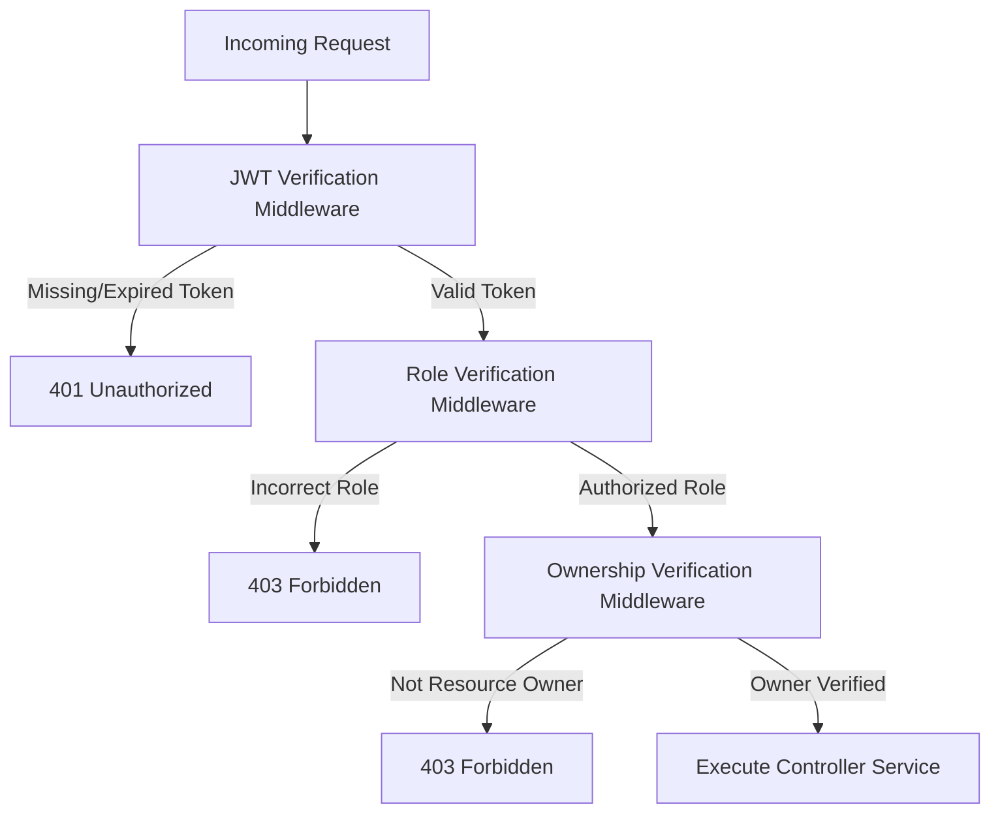

# API Design

This document details the REST API specifications, request/response payload contracts, authentication mechanisms, and routing architectures for the RecruitIQ platform MVP.

The backend Express.js service exposes stateless endpoints to handle client applications, authenticate users, facilitate resume uploads to Supabase Storage, and trigger the LLM comparison pipeline. All contracts documented here align with the schemas defined in [Database Design](file:///Users/jinay/Desktop/Workspace/MERN%20Full%20Stack/RecruitIQ/docs/06_Database_Design.md) and the boundaries described in [System Architecture](file:///Users/jinay/Desktop/Workspace/MERN%20Full%20Stack/RecruitIQ/docs/05_System_Architecture.md).

---

## 1. Introduction

### Purpose
The purpose of this document is to establish a strict, contract-driven interface boundary between the React frontend and the Express.js backend. Developers must adhere strictly to these schemas during implementation to prevent integration issues and ensure data integrity.

### REST API Philosophy
The API is built upon RESTful conventions:
*   **Resource-Oriented URIs:** Logical resources (e.g., jobs, resumes, applications) are addressed using plural nouns.
*   **Stateless Operations:** The server does not retain session state. Each incoming request must carry all context and authorization credentials required to execute.
*   **JSON Transmission:** Request bodies and response payloads use JSON format, except for file uploads which use `multipart/form-data`.

### JWT Authentication Strategy
Authentication is established via JSON Web Tokens (JWT).
1.  **Generation:** Upon successful login or registration, the server issues a signed JWT containing the user's database `_id`, `email`, and their domain-specific `role` (`Candidate` or `Recruiter`).
2.  **Transmission:** The client stores the token in memory/local storage and transmits it in the `Authorization` header of all protected requests using the standard Bearer scheme:
    ```http
    Authorization: Bearer <JWT_TOKEN>
    ```
3.  **Verification:** The server intercepts protected requests, validates the signature using the server secret key, parses the role, and attaches the payload to the request context (`req.user`).

### HTTP Methods Used
The API utilizes standard HTTP verbs to signify database operations:
*   `GET`: Retrieve resources (safe and idempotent).
*   `POST`: Create new resources or execute custom processes (non-idempotent).
*   `PATCH`: Update existing resources partially.
*   `DELETE`: Remove resources.

### HTTP Status Codes
The API uses standard HTTP response codes to indicate status:
*   `200 OK`: Request succeeded. Response body contains the requested data.
*   `201 Created`: Resource creation succeeded. Returned on successful registration and resource generation.
*   `400 Bad Request`: Payload validation failed, or request parameters are missing/malformed.
*   `401 Unauthorized`: Authentication failed or JWT token is invalid/missing.
*   `403 Forbidden`: Authenticated user lacks permissions or role authorizations to access the resource.
*   `404 Not Found`: Target resource does not exist.
*   `500 Internal Server Error`: Unhandled server-side failure.

---

## 2. API Design Principles

*   **RESTful Naming:** Resource endpoints use plural nouns (e.g., `/jobs`, `/applications`). Nested resources are avoided in the MVP to keep route handlers simple and flat.
*   **Stateless APIs:** Every request is authenticated independently. Session tracking is entirely managed on the client side via JWT.
*   **Consistent Endpoint Naming:** Routing paths use lowercase kebab-case (e.g., `/jobs/generate-jd`), while JSON key names use standard camelCase format.
*   **Proper HTTP Verbs:** Actions correspond directly to standard CRUD operations. Custom operations use `POST` verbs targeting sub-resources (e.g., `POST /jobs/generate-jd`, `POST /applications/:applicationId/analyze`).
*   **Standard Response Format:** All success and failure responses follow unified envelopes, enabling reliable deserialization.
*   **Standard Error Handling:** Unhandled exceptions and validation errors are captured by custom Express middleware, translating exceptions into standard JSON error envelopes with correct status codes.
*   **Authentication using JWT:** Secure identity verification using signed HMAC-SHA256 tokens.
*   **Authorization using Roles:** Role-Based Access Control (RBAC) is enforced at the router boundary using dedicated middleware.
*   **Future API Versioning Strategy:** To allow future breaking updates without disrupting existing clients, the system is designed to support URI-based versioning (e.g., `/api/v1/jobs`). While versioning prefixes are not implemented in the initial MVP route configurations to avoid complexity, they can be introduced at the central Express router level when needed.

---

## 3. Standard Response Format

To ensure consistent integration, all API responses conform to one of two structural envelopes.

### Success Response Envelope
All successful requests return a `2xx` status code and a JSON response with the following format:
```json
{
  "success": true,
  "message": "Operation completed successfully.",
  "data": {}
}
```

#### Fields:
*   `success` (Boolean): Always set to `true`. Useful for rapid frontend conditional checks.
*   `message` (String): A human-readable message summarizing the outcome.
*   `data` (Object | Array | null): Contains the primary response payload (e.g., a single document object, an array of listings, or operational details). Returns `null` if no payload is required.

### Error Response Envelope
All failed requests return a `4xx` or `5xx` status code and a JSON response with the following format:
```json
{
  "success": false,
  "message": "Request could not be completed.",
  "error": {
    "code": "ERROR_CODE",
    "details": {}
  }
}
```

#### Fields:
*   `success` (Boolean): Always set to `false`.
*   `message` (String): A brief description of the failure reason.
*   `error` (Object): Contains structured error details.
    *   `code` (String): A standardized, uppercase error identifier (e.g., `VALIDATION_ERROR`, `UNAUTHORIZED`, `NOT_FOUND`, `INTERNAL_SERVER_ERROR`).
    *   `details` (Object | String): Field-level errors (for validation failures) or technical debugging descriptors.

---

## 4. Authentication APIs

Authentication utilizes two separate pathways to accommodate the distinct candidate and recruiter user models.

### POST /recruiters/signup
*   **Purpose:** Register a new Recruiter profile and obtain an access token.
*   **Method:** `POST`
*   **Endpoint:** `/recruiters/signup`
*   **Authentication Required:** None (Public)
*   **Request Body:**
    ```json
    {
      "email": "hiring.manager@techcorp.com",
      "password": "StrongPassword99!",
      "companyName": "TechCorp Inc.",
      "companySize": "51-200",
      "industry": "Software Engineering",
      "companyWebsite": "https://techcorp.com"
    }
    ```
*   **Success Response (201 Created):**
    ```json
    {
      "success": true,
      "message": "Recruiter account registered successfully.",
      "data": {
        "recruiter": {
          "_id": "60c72b2f9b1d8a001f8e1234",
          "email": "hiring.manager@techcorp.com",
          "companyName": "TechCorp Inc.",
          "companySize": "51-200",
          "industry": "Software Engineering",
          "companyWebsite": "https://techcorp.com",
          "createdAt": "2026-07-13T16:47:42.000Z",
          "updatedAt": "2026-07-13T16:47:42.000Z"
        },
        "token": "eyJhbGciOiJIUzI1NiIsInR5cCI6IkpXVCJ9.eyJpZCI6IjYwYzcyYjJmOWIxZDhhMDAxZjhlMTIzNCIsImVtYWlsIjoiaGlyaW5nLm1hbmFnZXJAdGVjaGNvcnAuY29tIiwicm9sZSI6IlJlY3J1aXRlciJ9..."
      }
    }
    ```
*   **Error Responses:**
    *   **400 Bad Request (Validation Failure):**
        ```json
        {
          "success": false,
          "message": "Validation failed.",
          "error": {
            "code": "VALIDATION_ERROR",
            "details": {
              "email": "Email is already registered.",
              "password": "Password must be at least 8 characters long and contain numbers."
            }
          }
        }
        ```
    *   **500 Internal Server Error**

---

### POST /recruiters/login
*   **Purpose:** Authenticate an existing Recruiter and issue a JWT.
*   **Method:** `POST`
*   **Endpoint:** `/recruiters/login`
*   **Authentication Required:** None (Public)
*   **Request Body:**
    ```json
    {
      "email": "hiring.manager@techcorp.com",
      "password": "StrongPassword99!"
    }
    ```
*   **Success Response (200 OK):**
    ```json
    {
      "success": true,
      "message": "Login successful.",
      "data": {
        "recruiter": {
          "_id": "60c72b2f9b1d8a001f8e1234",
          "email": "hiring.manager@techcorp.com",
          "companyName": "TechCorp Inc."
        },
        "token": "eyJhbGciOiJIUzI1NiIsInR5cCI6IkpXVCJ9.eyJpZCI6IjYwYzcyYjJmOWIxZDhhMDAxZjhlMTIzNCIsImVtYWlsIjoiaGlyaW5nLm1hbmFnZXJAdGVjaGNvcnAuY29tIiwicm9sZSI6IlJlY3J1aXRlciJ9..."
      }
    }
    ```
*   **Error Responses:**
    *   **401 Unauthorized (Invalid Credentials):**
        ```json
        {
          "success": false,
          "message": "Invalid email or password.",
          "error": {
            "code": "UNAUTHORIZED",
            "details": "Credentials do not match any recruiter profile."
          }
        }
        ```
    *   **500 Internal Server Error**

---

### POST /candidates/signup
*   **Purpose:** Register a new Candidate profile and obtain an access token.
*   **Method:** `POST`
*   **Endpoint:** `/candidates/signup`
*   **Authentication Required:** None (Public)
*   **Request Body:**
    ```json
    {
      "email": "jane.developer@gmail.com",
      "password": "CandidatePassword77!",
      "firstName": "Jane",
      "lastName": "Doe",
      "phone": "+15550199"
    }
    ```
*   **Success Response (201 Created):**
    ```json
    {
      "success": true,
      "message": "Candidate account registered successfully.",
      "data": {
        "candidate": {
          "_id": "60c72b2f9b1d8a001f8e5678",
          "email": "jane.developer@gmail.com",
          "firstName": "Jane",
          "lastName": "Doe",
          "phone": "+15550199",
          "createdAt": "2026-07-13T16:47:42.000Z",
          "updatedAt": "2026-07-13T16:47:42.000Z"
        },
        "token": "eyJhbGciOiJIUzI1NiIsInR5cCI6IkpXVCJ9.eyJpZCI6IjYwYzcyYjJmOWIxZDhhMDAxZjhlNTY3OCIsImVtYWlsIjoiamFuZS5kZXZlbG9wZXJAZ21haWwuY29tIiwicm9sZSI6IkNhbmRpZGF0ZSJ9..."
      }
    }
    ```
*   **Error Responses:**
    *   **400 Bad Request (Validation Failure):**
        ```json
        {
          "success": false,
          "message": "Validation failed.",
          "error": {
            "code": "VALIDATION_ERROR",
            "details": {
              "email": "Email is already registered."
            }
          }
        }
        ```
    *   **500 Internal Server Error**

---

### POST /candidates/login
*   **Purpose:** Authenticate an existing Candidate and issue a JWT.
*   **Method:** `POST`
*   **Endpoint:** `/candidates/login`
*   **Authentication Required:** None (Public)
*   **Request Body:**
    ```json
    {
      "email": "jane.developer@gmail.com",
      "password": "CandidatePassword77!"
    }
    ```
*   **Success Response (200 OK):**
    ```json
    {
      "success": true,
      "message": "Login successful.",
      "data": {
        "candidate": {
          "_id": "60c72b2f9b1d8a001f8e5678",
          "email": "jane.developer@gmail.com",
          "firstName": "Jane",
          "lastName": "Doe"
        },
        "token": "eyJhbGciOiJIUzI1NiIsInR5cCI6IkpXVCJ9.eyJpZCI6IjYwYzcyYjJmOWIxZDhhMDAxZjhlNTY3OCIsImVtYWlsIjoiamFuZS5kZXZlbG9wZXJAZ21haWwuY29tIiwicm9sZSI6IkNhbmRpZGF0ZSJ9..."
      }
    }
    ```
*   **Error Responses:**
    *   **401 Unauthorized (Invalid Credentials):**
        ```json
        {
          "success": false,
          "message": "Invalid email or password.",
          "error": {
            "code": "UNAUTHORIZED",
            "details": "Credentials do not match any candidate profile."
          }
        }
        ```
    *   **500 Internal Server Error**

---

## 5. Dashboard APIs

Dashboard APIs provide consolidated metric overviews and active lists tailored for both recruiter and candidate screens.

### GET /dashboard/recruiter
*   **Purpose:** Fetch operational metrics and listing statuses for the Recruiter workspace.
*   **Method:** `GET`
*   **Endpoint:** `/dashboard/recruiter`
*   **Authentication Required:** Yes (JWT, Recruiter role only)
*   **Description:** Aggregates statistics corresponding to jobs owned by the authenticated recruiter. It compiles active listings, total applications, and applications pending review.
*   **Success Response (200 OK):**
    ```json
    {
      "success": true,
      "message": "Recruiter metrics retrieved successfully.",
      "data": {
        "metrics": {
          "activeJobsCount": 3,
          "totalApplicantsCount": 24,
          "pendingApplicationsCount": 8
        },
        "activeJobs": [
          {
            "_id": "60c72b2f9b1d8a001f8e1111",
            "title": "Software Engineer",
            "location": "Remote",
            "status": "Open",
            "applicantsCount": 14,
            "createdAt": "2026-07-10T08:00:00.000Z"
          },
          {
            "_id": "60c72b2f9b1d8a001f8e2222",
            "title": "Product Manager",
            "location": "New York, NY",
            "status": "Open",
            "applicantsCount": 10,
            "createdAt": "2026-07-12T09:30:00.000Z"
          }
        ]
      }
    }
    ```

---

### GET /dashboard/candidate
*   **Purpose:** Fetch active submission progress and metrics for the Candidate workspace.
*   **Method:** `GET`
*   **Endpoint:** `/dashboard/candidate`
*   **Authentication Required:** Yes (JWT, Candidate role only)
*   **Description:** Summarizes application history totals categorized by evaluation status, alongside details of each submission.
*   **Success Response (200 OK):**
    ```json
    {
      "success": true,
      "message": "Candidate metrics retrieved successfully.",
      "data": {
        "metrics": {
          "totalApplications": 2,
          "received": 1,
          "underReview": 1,
          "shortlisted": 0,
          "rejected": 0
        },
        "profileComplete": true,
        "applications": [
          {
            "_id": "60c72b2f9b1d8a001f8e9999",
            "job": {
              "_id": "60c72b2f9b1d8a001f8e1111",
              "title": "Software Engineer",
              "companyName": "TechCorp Inc.",
              "location": "Remote",
              "employmentType": "Full-time"
            },
            "status": "Under Review",
            "appliedAt": "2026-07-13T16:00:00.000Z"
          }
        ]
      }
    }
    ```

---

## 6. Job APIs

Job listing creation and management endpoints. Candidate routing is restricted to querying and details, while write/edit routes require Recruiter credentials and ownership validation.

### POST /jobs
*   **Purpose:** Publish a new job requisition.
*   **Method:** `POST`
*   **Endpoint:** `/jobs`
*   **Authentication Required:** Yes (JWT, Recruiter role only)
*   **Request Body:**
    ```json
    {
      "title": "Software Engineer",
      "description": "We are seeking a full-stack engineering lead...",
      "requirements": [
        "Strong knowledge of React and Node.js",
        "Proficiency with MongoDB schemas",
        "3+ years experience"
      ],
      "location": "Remote",
      "employmentType": "Full-time",
      "salaryRange": "$110,000 - $130,000"
    }
    ```
*   **Success Response (201 Created):**
    ```json
    {
      "success": true,
      "message": "Job posting published successfully.",
      "data": {
        "job": {
          "_id": "60c72b2f9b1d8a001f8e1111",
          "recruiterId": "60c72b2f9b1d8a001f8e1234",
          "title": "Software Engineer",
          "description": "We are seeking a full-stack engineering lead...",
          "requirements": [
            "Strong knowledge of React and Node.js",
            "Proficiency with MongoDB schemas",
            "3+ years experience"
          ],
          "location": "Remote",
          "employmentType": "Full-time",
          "salaryRange": "$110,000 - $130,000",
          "status": "Open",
          "createdAt": "2026-07-13T16:47:42.000Z",
          "updatedAt": "2026-07-13T16:47:42.000Z"
        }
      }
    }
    ```

---

### GET /jobs
*   **Purpose:** Query all open job listings.
*   **Method:** `GET`
*   **Endpoint:** `/jobs`
*   **Authentication Required:** None (Public / Candidate accessible)
*   **Supported Query Parameters:**
    *   `search` (String, optional): Matches keywords in the job's `title` or `description`.
    *   `location` (String, optional): Filters listings by `location`.
    *   `employmentType` (String, optional): Filters by `employmentType` (e.g., `Full-time`, `Part-time`, `Contract`, `Internship`).
    *   `page` (Number, optional): Page index for pagination (defaults to `1`).
    *   `limit` (Number, optional): Result size per page (defaults to `10`).
*   **Success Response (200 OK):**
    ```json
    {
      "success": true,
      "message": "Jobs retrieved successfully.",
      "data": {
        "jobs": [
          {
            "_id": "60c72b2f9b1d8a001f8e1111",
            "title": "Software Engineer",
            "companyName": "TechCorp Inc.",
            "location": "Remote",
            "employmentType": "Full-time",
            "salaryRange": "$110,000 - $130,000",
            "status": "Open",
            "createdAt": "2026-07-13T16:47:42.000Z"
          }
        ],
        "pagination": {
          "total": 1,
          "page": 1,
          "limit": 10,
          "pages": 1
        }
      }
    }
    ```

---

### GET /jobs/:jobId
*   **Purpose:** Fetch the full details of a specific job posting.
*   **Method:** `GET`
*   **Endpoint:** `/jobs/:jobId`
*   **Authentication Required:** None (Public / Candidate accessible)
*   **Success Response (200 OK):**
    ```json
    {
      "success": true,
      "message": "Job details retrieved successfully.",
      "data": {
        "job": {
          "_id": "60c72b2f9b1d8a001f8e1111",
          "recruiterId": "60c72b2f9b1d8a001f8e1234",
          "title": "Software Engineer",
          "description": "We are seeking a full-stack engineering lead...",
          "requirements": [
            "Strong knowledge of React and Node.js",
            "Proficiency with MongoDB schemas",
            "3+ years experience"
          ],
          "location": "Remote",
          "employmentType": "Full-time",
          "salaryRange": "$110,000 - $130,000",
          "status": "Open",
          "createdAt": "2026-07-13T16:47:42.000Z"
        }
      }
    }
    ```

---

### PATCH   /jobs/:jobId
*   **Purpose:** Update attributes or status of a job requisition.
*   **Method:** `PATCH`
*   **Endpoint:** `/jobs/:jobId`
*   **Authentication Required:** Yes (JWT, Recruiter role + Resource ownership validation)
*   **Request Body:** Can include partial parameters to update (e.g., closing a requisition).
    ```json
    {
      "status": "Closed"
    }
    ```
*   **Success Response (200 OK):**
    ```json
    {
      "success": true,
      "message": "Job updated successfully.",
      "data": {
        "job": {
          "_id": "60c72b2f9b1d8a001f8e1111",
          "recruiterId": "60c72b2f9b1d8a001f8e1234",
          "title": "Software Engineer",
          "status": "Closed",
          "updatedAt": "2026-07-13T16:49:00.000Z"
        }
      }
    }
    ```

---

### DELETE  /jobs/:jobId
*   **Purpose:** Delete a job requisition posting.
*   **Method:** `DELETE`
*   **Endpoint:** `/jobs/:jobId`
*   **Authentication Required:** Yes (JWT, Recruiter role + Resource ownership validation)
*   **Success Response (200 OK):**
    ```json
    {
      "success": true,
      "message": "Job posting deleted successfully. Historical applications are preserved.",
      "data": null
    }
    ```

---

### POST    /jobs/generate-jd
*   **Purpose:** Generate a formatted markdown job description using AI assistance.
*   **Method:** `POST`
*   **Endpoint:** `/jobs/generate-jd`
*   **Authentication Required:** Yes (JWT, Recruiter role only)
*   **Request Body:**
    ```json
    {
      "title": "Product Designer",
      "responsibilities": ["Design high-fidelity UI", "Conduct user interviews", "Maintain Figma design system"],
      "skills": ["Figma", "User Research", "Wireframing", "A/B Testing"]
    }
    ```
*   **Success Response (200 OK):**
    ```json
    {
      "success": true,
      "message": "Job description generated successfully.",
      "data": {
        "description": "### Product Designer\n\n**About the Role:**\nWe are looking for an experienced Product Designer...\n\n**Responsibilities:**\n* Design high-fidelity UI elements...\n* Conduct user interviews...\n* Maintain and scale the Figma design system.\n\n**Requirements:**\n* Proficiency with Figma, User Research, and Wireframing..."
      }
    }
    ```

---

## 7. Resume API

The Resume API handles raw document processing, storage delegation, and structured property extraction.

### POST /resumes
*   **Purpose:** Upload a candidate's resume file, save it to storage, and parse it using the AI extraction pipeline.
*   **Method:** `POST`
*   **Endpoint:** `/resumes`
*   **Authentication Required:** Yes (JWT, Candidate role only)
*   **Request Type:** `multipart/form-data`
*   **Request Payload:**
    *   `file` (Binary File): PDF or DOCX file (size limit: 10MB).
*   **Workflow:**
    1.  Express routes the file stream through `Multer`.
    2.  The backend streams the binary payload to Supabase Storage.
    3.  A read-only public URL is generated.
    4.  The LangChain parser reads the document text.
    5.  Groq extracts structured JSON schema properties (name, phone, experience, education, skills).
    6.  The extracted data is stored in the `Resume` collection and returned.
*   **Success Response (201 Created):**
    ```json
    {
      "success": true,
      "message": "Resume uploaded and parsed successfully.",
      "data": {
        "resume": {
          "_id": "60c72b2f9b1d8a001f8e3333",
          "candidateId": "60c72b2f9b1d8a001f8e5678",
          "fileUrl": "https://supabase.co/storage/v1/object/public/resumes/resume_123.pdf",
          "parsedData": {
            "personalInfo": {
              "firstName": "Jane",
              "lastName": "Doe",
              "email": "jane.developer@gmail.com",
              "phone": "+15550199"
            },
            "skills": ["React", "TypeScript", "Node.js", "Express", "MongoDB", "Figma"],
            "experience": [
              {
                "role": "Frontend Developer",
                "company": "DesignCo",
                "startDate": "2024-01",
                "endDate": "Present",
                "responsibilities": "Built single-page React applications, collaborated with designers."
              }
            ],
            "education": [
              {
                "institution": "State University",
                "degree": "B.S. Software Engineering",
                "graduationYear": "2023"
              }
            ]
          },
          "createdAt": "2026-07-13T16:47:42.000Z"
        }
      }
    }
    ```
*   **Error Responses:**
    *   **400 Bad Request (Invalid file type or size limits exceeded):**
        ```json
        {
          "success": false,
          "message": "Invalid file upload.",
          "error": {
            "code": "UPLOAD_ERROR",
            "details": "Only PDF and DOCX files are allowed. Maximum size limit is 10MB."
          }
        }
        ```
    *   **500 Internal Server Error**

---

## 8. Application APIs

Application APIs track candidates applying to open requisitions and facilitate status changes and matching evaluations.

### POST /applications
*   **Purpose:** Submit a new job application referencing a candidate, job, and resume.
*   **Method:** `POST`
*   **Endpoint:** `/applications`
*   **Authentication Required:** Yes (JWT, Candidate role only)
*   **Request Body:**
    ```json
    {
      "jobId": "60c72b2f9b1d8a001f8e1111",
      "resumeId": "60c72b2f9b1d8a001f8e3333"
    }
    ```
*   **Success Response (201 Created):**
    ```json
    {
      "success": true,
      "message": "Application submitted successfully. AI analysis initiated.",
      "data": {
        "application": {
          "_id": "60c72b2f9b1d8a001f8e9999",
          "candidateId": "60c72b2f9b1d8a001f8e5678",
          "jobId": "60c72b2f9b1d8a001f8e1111",
          "resumeId": "60c72b2f9b1d8a001f8e3333",
          "status": "Received",
          "createdAt": "2026-07-13T16:47:42.000Z"
        }
      }
    }
    ```
*   **Error Responses:**
    *   **400 Bad Request (Duplicate application restriction):**
        ```json
        {
          "success": false,
          "message": "Duplicate submission detected.",
          "error": {
            "code": "DUPLICATE_APPLICATION",
            "details": "You have already applied to this job."
          }
        }
        ```

---

### GET /applications
*   **Purpose:** Retrieve a list of applications.
*   **Method:** `GET`
*   **Endpoint:** `/applications`
*   **Authentication Required:** Yes (JWT, context dependent)
*   **Description:**
    *   If the requester is a **Candidate**, the endpoint returns their submission history.
    *   If the requester is a **Recruiter**, it returns submissions corresponding to jobs they own.
*   **Supported Query Parameters:**
    *   `jobId` (String, optional, Recruiter only): Filters applications by job posting.
    *   `status` (String, optional): Filters applications by evaluation status (`Received`, `Under Review`, `Shortlisted`, `Rejected`).
*   **Success Response (200 OK):**
    ```json
    {
      "success": true,
      "message": "Applications retrieved successfully.",
      "data": {
        "applications": [
          {
            "_id": "60c72b2f9b1d8a001f8e9999",
            "jobId": {
              "_id": "60c72b2f9b1d8a001f8e1111",
              "title": "Software Engineer"
            },
            "candidateId": {
              "_id": "60c72b2f9b1d8a001f8e5678",
              "firstName": "Jane",
              "lastName": "Doe"
            },
            "status": "Received",
            "createdAt": "2026-07-13T16:47:42.000Z"
          }
        ]
      }
    }
    ```

---

### GET /applications/:applicationId
*   **Purpose:** Fetch the full details of a specific application, including resume and AI evaluation profiles.
*   **Method:** `GET`
*   **Endpoint:** `/applications/:applicationId`
*   **Authentication Required:** Yes (JWT, candidate owner or parent job recruiter owner)
*   **Success Response (200 OK):**
    ```json
    {
      "success": true,
      "message": "Application details retrieved successfully.",
      "data": {
        "application": {
          "_id": "60c72b2f9b1d8a001f8e9999",
          "status": "Received",
          "createdAt": "2026-07-13T16:47:42.000Z",
          "job": {
            "_id": "60c72b2f9b1d8a001f8e1111",
            "title": "Software Engineer",
            "requirements": ["Strong knowledge of React and Node.js"]
          },
          "candidate": {
            "_id": "60c72b2f9b1d8a001f8e5678",
            "firstName": "Jane",
            "lastName": "Doe",
            "email": "jane.developer@gmail.com",
            "phone": "+15550199"
          },
          "resume": {
            "_id": "60c72b2f9b1d8a001f8e3333",
            "fileUrl": "https://supabase.co/storage/v1/object/public/resumes/resume_123.pdf",
            "parsedData": {
              "skills": ["React", "TypeScript", "Node.js"]
            }
          },
          "aiAnalysis": {
            "_id": "60c72b2f9b1d8a001f8e4444",
            "matchingScore": 90,
            "matchingSkills": ["React", "Node.js"],
            "missingSkills": ["MongoDB"],
            "strengths": ["Solid React foundational project experience."],
            "weaknesses": ["No database qualifications documented in resume."],
            "recommendation": "Strong candidate",
            "summary": "Jane demonstrates strong capabilities in front-end development..."
          }
        }
      }
    }
    ```

---

### PATCH /applications/:applicationId/status
*   **Purpose:** Update the evaluation status of a candidate's application.
*   **Method:** `PATCH`
*   **Endpoint:** `/applications/:applicationId/status`
*   **Authentication Required:** Yes (JWT, Recruiter role + Parent job ownership validation)
*   **Request Body:**
    ```json
    {
      "status": "Shortlisted"
    }
    ```
    *Note: Valid statuses are: `Received`, `Under Review`, `Shortlisted`, or `Rejected`.*
*   **Success Response (200 OK):**
    ```json
    {
      "success": true,
      "message": "Application status updated successfully.",
      "data": {
        "application": {
          "_id": "60c72b2f9b1d8a001f8e9999",
          "status": "Shortlisted",
          "updatedAt": "2026-07-13T16:50:00.000Z"
        }
      }
    }
    ```

---

### POST /applications/:applicationId/analyze
*   **Purpose:** Manually trigger or re-run the AI comparison evaluation between the candidate's resume and the job requisition.
*   **Method:** `POST`
*   **Endpoint:** `/applications/:applicationId/analyze`
*   **Authentication Required:** Yes (JWT, Recruiter role + Parent job ownership validation)
*   **Execution Pipeline Steps:**
    1.  **Retrieve Application:** Query the database for the targeted application record using the `applicationId`. Throw a `404 Not Found` if it does not exist.
    2.  **Retrieve Resume:** Load the referenced `Resume` document containing the parsed JSON data (`parsedData`).
    3.  **Retrieve Job:** Load the referenced `Job` requisition document detailing key parameters and requirements.
    4.  **Execute AI Analysis:** Format and feed both document profiles to the Groq inference engine with the evaluation template prompts.
    5.  **Store AIAnalysis:** Write the LLM results to the `AIAnalysis` collection, linking the parent `applicationId` to maintain the One-to-One structural mapping.
    6.  **Return Analysis:** Respond back with the compiled `AIAnalysis` document metrics.
*   **Success Response (200 OK):**
    ```json
    {
      "success": true,
      "message": "AI matching evaluation completed and saved successfully.",
      "data": {
        "aiAnalysis": {
          "_id": "60c72b2f9b1d8a001f8e4444",
          "applicationId": "60c72b2f9b1d8a001f8e9999",
          "matchingScore": 90,
          "matchingSkills": ["React", "Node.js"],
          "missingSkills": ["MongoDB"],
          "strengths": ["Solid React foundational project experience."],
          "weaknesses": ["No database qualifications documented in resume."],
          "recommendation": "Strong candidate",
          "summary": "Jane demonstrates strong capabilities in front-end development..."
        }
      }
    }
    ```

---

## 9. Authentication & Authorization

Route permissions are enforced at the API gateway layer using route handlers and middleware layers.



### Public APIs (No Token Required)
*   `POST /recruiters/signup`
*   `POST /recruiters/login`
*   `POST /candidates/signup`
*   `POST /candidates/login`
*   `GET /jobs` (For job seekers to browse listings)
*   `GET /jobs/:jobId` (For job seekers to read posting specifics)

### Protected APIs (Valid JWT Token Required)
All other endpoints require an `Authorization: Bearer <token>` header.

### Recruiter-Only Protected APIs (Recruiter Role Enforced)
*   `GET /dashboard/recruiter`
*   `POST /jobs`
*   `PATCH /jobs/:jobId` (Requires ownership verification)
*   `DELETE /jobs/:jobId` (Requires ownership verification)
*   `POST /jobs/generate-jd`
*   `PATCH /applications/:applicationId/status` (Requires parent job ownership check)
*   `POST /applications/:applicationId/analyze` (Requires parent job ownership check)

### Candidate-Only Protected APIs (Candidate Role Enforced)
*   `GET /dashboard/candidate`
*   `POST /resumes`
*   `POST /applications`

---

## 10. Complete API Summary

The table below lists all endpoints verified for the RecruitIQ MVP architecture.

| Module | Method | Endpoint | Purpose | Authorization Required |
| :--- | :--- | :--- | :--- | :--- |
| **Authentication** | `POST` | `/recruiters/signup` | Register a new recruiter account | Public |
| **Authentication** | `POST` | `/recruiters/login` | Authenticate recruiter and return JWT | Public |
| **Authentication** | `POST` | `/candidates/signup` | Register a new candidate account | Public |
| **Authentication** | `POST` | `/candidates/login` | Authenticate candidate and return JWT | Public |
| **Dashboard** | `GET` | `/dashboard/recruiter` | Retrieve recruiter aggregated counts and job list | Protected (Recruiter) |
| **Dashboard** | `GET` | `/dashboard/candidate` | Retrieve candidate application metrics and list | Protected (Candidate) |
| **Jobs** | `POST` | `/jobs` | Publish a new job requisition | Protected (Recruiter) |
| **Jobs** | `GET` | `/jobs` | Fetch filterable list of open job listings | Public |
| **Jobs** | `GET` | `/jobs/:jobId` | Retrieve full description details for a job | Public |
| **Jobs** | `PATCH` | `/jobs/:jobId` | Update details/status of a job posting | Protected (Recruiter + Owner) |
| **Jobs** | `DELETE`| `/jobs/:jobId` | Remove a job listing posting | Protected (Recruiter + Owner) |
| **Jobs** | `POST` | `/jobs/generate-jd` | Generate job description draft via AI | Protected (Recruiter) |
| **Resumes** | `POST` | `/resumes` | Upload resume file and trigger AI parsing | Protected (Candidate) |
| **Applications** | `POST` | `/applications` | Apply to a job by referencing job and resume | Protected (Candidate) |
| **Applications** | `GET` | `/applications` | Retrieve list of applications (role-filtered) | Protected (Any Role) |
| **Applications** | `GET` | `/applications/:applicationId` | Retrieve detailed view of a single application | Protected (Owner/Recruiter) |
| **Applications** | `PATCH`| `/applications/:applicationId/status` | Update candidate evaluation status | Protected (Recruiter + Owner) |
| **Applications** | `POST` | `/applications/:applicationId/analyze` | Trigger or re-run resume matching LLM pipeline | Protected (Recruiter + Owner) |

---

## 11. Future APIs

The following capabilities are intentionally postponed from the MVP to keep implementation focused on core decision support during initial deployment. They are slated for implementation in future phases:

*   **Logout (`POST /auth/logout`):** Currently handled statelessly on the client by purging stored tokens from local storage. Real-time revocation via token blacklists will be added in later releases.
*   **View Profile (`GET /candidates/profile`, `GET /recruiters/profile`):** Currently implicitly populated during registration and workspace retrieval. A dedicated management view will be added.
*   **Update Profile (`PATCH /candidates/profile`, `PATCH /recruiters/profile`):** Postponed to separate views in post-MVP deployments.
*   **Change Password (`POST /auth/change-password`):** Credentials modification workflow.
*   **Resume CRUD (`GET /resumes`, `DELETE /resumes`):** Advanced personal file storage management allowing candidates to delete or rename documents in their libraries.
*   **Recruiter CRUD (`GET /recruiters`, `DELETE /recruiters`):** Agency profile directory and administrative account purging workflows.
*   **Candidate CRUD (`GET /candidates`, `DELETE /candidates`):** Job seeker account purging workflows.
*   **AI CRUD (`GET /ai-analyses`, `DELETE /ai-analyses`):** Management dashboards allowing administrator control over evaluation templates and prompt models.
*   **Dashboard Analytics (`GET /dashboard/analytics`):** Detailed corporate reporting tracking metrics like average time-to-hire, funnel conversions, and source efficacy.
