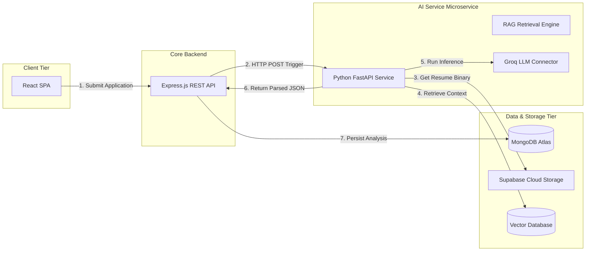
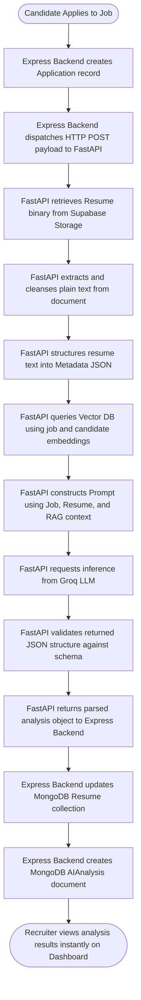
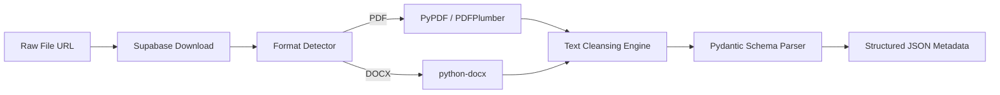
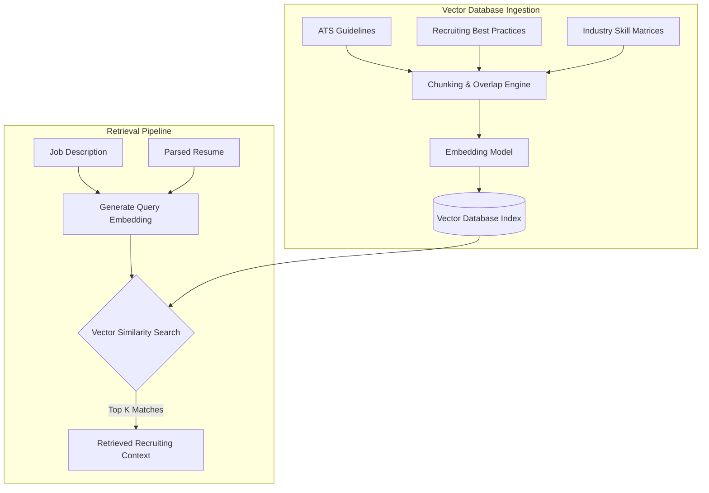
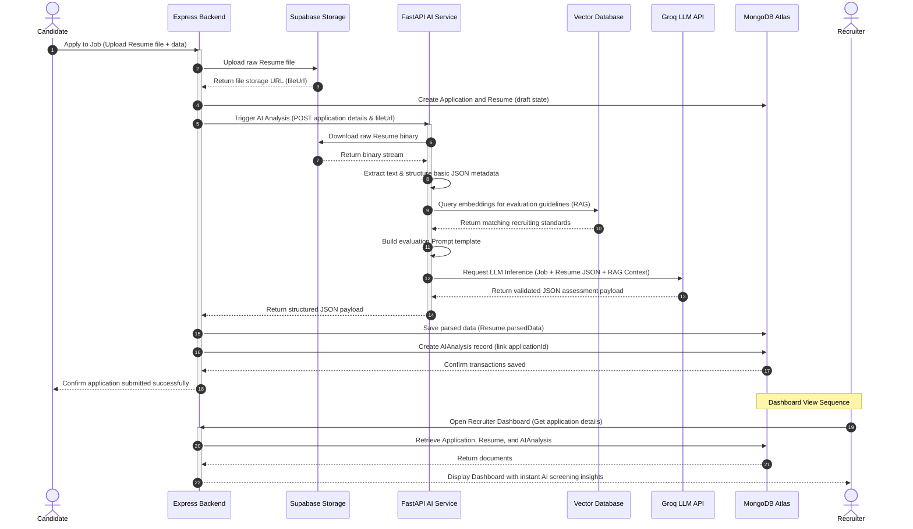

# AI Architecture

This document details the Artificial Intelligence architecture, pipeline workflow, prompt engineering strategies, and Retrieval-Augmented Generation (RAG) implementation for the RecruitIQ platform. 

The AI pipeline is designed to provide automated, objective, and consistent screening of candidate resumes against job descriptions, delivering structured evaluations directly to recruiters immediately upon application submission.

---

## 1. Overview

The primary objective of the RecruitIQ AI architecture is to automate the preliminary resume screening process. By extracting text from unstructured resume documents, parsing them into structured JSON, retrieving domain-specific guidelines using RAG, and performing semantic evaluation via a Large Language Model (LLM), the platform removes manual screening bottlenecks and reduces cognitive bias.

### Integration with RecruitIQ
The AI system is implemented as a decoupled microservice that operates alongside the core backend service. 
*   **Asynchronous Processing:** Immediately after a candidate applies for a job, the Express backend registers the application and dispatches a request to the AI service. This offloads compute-heavy document processing, text parsing, and LLM orchestration, preventing blockages in client-facing API responses.
*   **Immediate Availability:** Recruiters do not need to manually trigger resume analysis. The results are generated in the background and stored directly in the database, allowing recruiters to view comprehensive candidate analyses instantly upon opening their dashboard.

---

## 2. AI Service Architecture

The RecruitIQ AI stack is structured to isolate processing duties, utilize dedicated high-speed inference, and ground model evaluations with structured recruitment knowledge.



### Component Responsibilities

| Component | Responsibility / Role in AI Pipeline |
| :--- | :--- |
| **Express Backend** | Serves as the primary transaction coordinator. It handles client requests, stores the raw resume files in Supabase Storage, registers applications, initiates the AI analysis by calling the FastAPI microservice, receives the processed result, and writes the structured records to MongoDB Atlas. |
| **FastAPI AI Service** | A high-performance Python microservice optimized for data engineering, text extraction, and machine learning pipelines. It manages the lifecycle of the AI request, downloads files, extracts and cleans text, queries the Vector Database, builds prompts, and manages Groq LLM API communication. |
| **Vector Database** | Indexes high-dimensional embeddings representing professional recruiting guidelines, ATS heuristics, and resume writing benchmarks. It provides semantic search capabilities to retrieve relevant context based on job requirements and candidate profiles. |
| **Groq LLM API** | Serves as the high-speed inference provider. It runs Llama-based LLMs to perform candidate assessment, resume structure parsing, and detailed text synthesis according to prompt parameters. |
| **Supabase Storage** | Retains raw resume binaries (PDF and DOCX). The FastAPI service accesses these buckets using secure read URLs to retrieve document binaries for processing. |
| **MongoDB Atlas** | Houses candidate data, resume parsed records (`Resume.parsedData`), and the generated AI evaluation summaries (`AIAnalysis` collection) to enable fast dashboard loading. |

---

## 3. End-to-End AI Workflow

The AI analysis workflow follows a fully automated sequence triggered by the candidate's application submission. There is no manual intervention or "Analyze" step required by recruiters during standard intake.

### Operational Sequence Flowchart



1.  **Application Initiation:** A candidate uploads a resume and submits an application through the React frontend.
2.  **Asset Storage:** The Express backend uploads the raw file binary to Supabase Storage, generating a unique asset URI, and inserts the `Application` document into MongoDB.
3.  **Microservice Activation:** Express immediately makes a POST request to the FastAPI endpoint `/api/v1/analyze` containing the `applicationId`, `resumeUrl`, and `jobDescription` text.
4.  **Resource Fetching:** The FastAPI service fetches the resume binary from the provided Supabase URL.
5.  **Text Extraction & Structuring:** FastAPI converts the document to raw text, cleanses formatting metadata, and structures the candidate's core profile parameters.
6.  **RAG Context Retrieval:** The service queries the Vector Database using embeddings representing the job description and candidate experience to isolate matching guidelines.
7.  **LLM Call:** FastAPI compiles a prompt containing the job description, structured candidate details, RAG guidelines, and expected JSON formatting. This prompt is submitted to the Groq API.
8.  **Output Parsing & Validation:** The FastAPI service parses Groq's output, verifies that all expected metrics and text lists are populated, and returns a structured JSON payload to the Express backend.
9.  **Database Sync:** Express writes the structured profile to the `Resume` collection under `parsedData` and writes the scoring metrics, summary, and suggestions into the `AIAnalysis` collection, referencing the `applicationId`.
10. **Recruiter Delivery:** When the recruiter accesses the job applicant list, the frontend loads the saved analysis instantly from MongoDB.

---

## 4. Resume Processing Pipeline

The FastAPI microservice implements a multi-stage data ingestion pipeline to convert raw binary resume files into standard JSON records.



### 1. Resume Download
The pipeline retrieves the document file stream from Supabase Cloud Storage using secure HTTPS connections. The file content is held in memory buffers to avoid local disk writing and security vulnerabilities.

### 2. Text Extraction
The service automatically reads the file extension and delegates extraction to specialized libraries:
*   **PDF Documents:** PyPDF or PDFPlumber extracts raw string characters, preserving line endings where possible.
*   **DOCX Documents:** python-docx parses the XML structure, extracting paragraph text and tables.

### 3. Text Cleansing
The extracted plain text undergoes cleaning to strip noise and reduce token consumption:
*   Removal of non-printable ASCII and control characters.
*   Standardization of whitespace (collapsing multiple spaces and tabs).
*   Stripping of repetitive document headers, footers, and page numbers.
*   Normalization of common bullet points and hyphen variants.

### 4. Structured JSON Parsing
The cleaned text is processed using a fast initial schema parsing prompt to output a basic candidate schema. This structures unstructured text blocks into discrete sections: Personal Information, Work Experience, Education, and Skills. The FastAPI application validates the structure using **Pydantic** models before it is forwarded to the matching evaluation stage.

---

## 5. RAG Architecture

The matching engine uses Retrieval-Augmented Generation (RAG) to ensure LLM evaluations are grounded in industry standards rather than arbitrary parametric assumptions.



### Knowledge Base
The Vector Database houses a corpus of recruitment-specific domain knowledge. The datasets include:
*   **ATS Guidelines:** Specific benchmarks detailing how resumes should be structured for high readability, how skills should be presented, and common parsing limitations.
*   **Recruiter Best Practices:** Industry guidelines for matching experience years to specific seniority levels, assessing candidate trajectory, and spotting red flags.
*   **Resume Writing Guides:** Standards outlining high-impact, results-oriented resume conventions.
*   **Action Verb References:** Taxonomies of strong action verbs linked to candidate accomplishments (e.g., "Led", "Optimized", "Engineered").
*   **Industry Hiring Articles:** Domain matrices mapping tech stacks to specific job categories, helping the LLM understand semantic relationships between related technologies (e.g., that React, Vue, and Angular represent front-end skills).

### Processing Strategy
1.  **Chunking:** The knowledge documents are divided using a recursive text splitter with a chunk size of 800 characters and a 10% overlap (80 characters) to ensure semantic boundaries are maintained.
2.  **Embedding Generation:** Each chunk is converted into a 1536-dimensional vector using a high-density embedding model and stored in the Vector Database.
3.  **Retrieval Logic:** When an application is analyzed, the system generates query embeddings from the job description and candidate's work history. It queries the Vector Database using cosine similarity to retrieve the top $K$ (typically $K=3$) most relevant chunks.
4.  **Context Injection:** The retrieved chunks are formatted as a text block and injected into the LLM system prompt as the "Reference Evaluation Guidelines".

### Benefits of RAG in RecruitIQ
*   **Reduced Hallucination:** The LLM does not invent arbitrary scores; it evaluates candidate alignment strictly using the injected recruiting standards.
*   **Contextual Understanding:** RAG injects industry matrices, enabling the system to recognize that a candidate with "Express" and "FastAPI" experience meets backend requirements, even if the job description specifically asks for "Node.js".
*   **Actionable Feedback:** Resume suggestions are drawn directly from official resume-writing guides, ensuring that candidates receive practical, structured improvement recommendations.

---

## 6. Prompt Engineering

The matching evaluation relies on a multi-layered prompt designed to enforce structured JSON output and ensure objective scoring.

### Prompt Construction
The prompt is constructed dynamically by the FastAPI prompt engine, combining six independent content modules:

```
┌──────────────────────────────────────────────────────────┐
│ 1. System Prompt (Role, Anti-bias directives, JSON mandate)│
├──────────────────────────────────────────────────────────┤
│ 2. Job Description (Title, requirements, duties)          │
├──────────────────────────────────────────────────────────┤
│ 3. Parsed Candidate Resume (JSON profile schema)          │
├──────────────────────────────────────────────────────────┤
│ 4. Retrieved Context (RAG guidelines, ATS standards)     │
├──────────────────────────────────────────────────────────┤
│ 5. Scoring & Assessment Instructions                      │
├──────────────────────────────────────────────────────────┤
│ 6. Output Format Definition (Strict JSON outline)       │
└──────────────────────────────────────────────────────────┘
```

1.  **System Prompt:** Defines the persona of a Senior Technical Recruiter and ATS Auditor. It commands the model to remain neutral, objective, and focus strictly on the candidate's alignment with the provided requirements.
2.  **Job Description:** Injects the target job requirements.
3.  **Parsed Resume:** Injects the structured candidate data (`parsedData`) retrieved during the resume parsing phase.
4.  **Retrieved Context:** Injects the relevant guidelines retrieved from the RAG vector index.
5.  **Assessment Instructions:** Details how to evaluate each dimension:
    *   *ATS Score:* Based on structural readability, formatting, and standard parsing layout.
    *   *Technical Score:* Hard capability matching.
    *   *Experience Score:* Years of experience, level of responsibility, and career progression.
    *   *Education Score:* Degree relevance and level compared to job prerequisites.
6.  **Expected JSON Output:** Enforces output formatting. The prompt explicitly orders the model to output a valid JSON object without markdown headers, greeting messages, or trailing text.

---

## 7. Analysis Output

The result returned by the Groq inference engine and validated by FastAPI is a structured JSON payload. The following table describes the schema fields:

| Field Name | Type | Description | Scoring / Generation Heuristics |
| :--- | :--- | :--- | :--- |
| `summary` | String | Executive profile summary detailing the candidate's suitability. | Generates a 3-4 sentence summary emphasizing the candidate's core competencies and career alignment. |
| `overallScore` | Number | A comprehensive score from 0 to 100. | Calculated as a weighted average: Technical (35%), Experience (35%), ATS (15%), and Education (15%). |
| `atsScore` | Number | Score from 0 to 100 assessing layout, formatting, and keyword optimizations. | Deducts points for nested graphics, tables, non-standard fonts, or missing contact/profile sections. |
| `technicalScore` | Number | Score from 0 to 100 assessing hard skill alignment. | Measures direct and secondary overlaps between job requirements and candidate's declared technologies. |
| `experienceScore` | Number | Score from 0 to 100 assessing work history depth. | Evaluates direct tenure, career progression, domain-relevant titles, and scope of responsibilities. |
| `educationScore` | Number | Score from 0 to 100 assessing academic qualifications. | Evaluates highest degree completed, matching of major/field of study, and minimum job education requirements. |
| `matchedSkills` | Array[String] | Skills present in the resume that match job requirements. | Extracts direct keyword matches and high-confidence semantic synonyms. |
| `missingSkills` | Array[String] | Required skills from the job description not present in the resume. | Identifies gaps between core job requirements and the candidate's profile. |
| `strengths` | Array[String] | Categorized professional highlights of the candidate. | Focuses on areas where the candidate exceeds requirements (e.g., senior leadership experience). |
| `weaknesses` | Array[String] | Identified qualifications gaps or areas of concern. | Identifies areas where the candidate falls short (e.g., lack of experience with a primary tool, short tenures). |
| `recommendation` | String | Actionable hiring decision indicator. | Restricts to predefined categories: `Strong Match`, `Good Match`, `Borderline Match`, or `Unsuitable`. |
| `improvementSuggestions` | Array[String] | Steps the candidate can take to optimize their resume. | Provides suggestions for editing resume phrasing, adding missing sections, or formatting changes. |

---

## 8. Data Persistence

The Express backend coordinates data persistence across MongoDB Atlas, separating application transactions, parsed profiles, and detailed evaluations.

### 1. Resume Collection (`Resume`)
Stores the parsed resume structure. This data is persistent and can be reused if the candidate applies to other jobs within the system.
```json
{
  "_id": "ObjectId",
  "candidateId": "ObjectId (ref: Candidate)",
  "fileUrl": "String (Supabase Storage URL)",
  "parsedData": {
    "contactInfo": {
      "name": "String",
      "email": "String",
      "phone": "String"
    },
    "skills": ["String"],
    "experience": [
      {
        "title": "String",
        "company": "String",
        "duration": "String",
        "description": "String"
      }
    ],
    "education": [
      {
        "school": "String",
        "degree": "String",
        "fieldOfStudy": "String",
        "gradYear": "Number"
      }
    ]
  },
  "createdAt": "Date",
  "updatedAt": "Date"
}
```

### 2. AIAnalysis Collection (`AIAnalysis`)
Stores the assessment evaluation. This document maintains a strict **One-to-One** relationship with the `Application` collection.
```json
{
  "_id": "ObjectId",
  "applicationId": "ObjectId (ref: Application)",
  "summary": "String",
  "overallScore": "Number",
  "atsScore": "Number",
  "technicalScore": "Number",
  "experienceScore": "Number",
  "educationScore": "Number",
  "matchedSkills": ["String"],
  "missingSkills": ["String"],
  "strengths": ["String"],
  "weaknesses": ["String"],
  "recommendation": "String",
  "improvementSuggestions": ["String"],
  "createdAt": "Date",
  "updatedAt": "Date"
}
```

### 3. Application Collection (`Application`)
Maintains the transactional reference mapping of candidate applications.
```json
{
  "_id": "ObjectId",
  "candidateId": "ObjectId (ref: Candidate)",
  "jobId": "ObjectId (ref: Job)",
  "resumeId": "ObjectId (ref: Resume)",
  "status": "String (Enum: Received, Under Review, Shortlisted, Rejected)",
  "createdAt": "Date",
  "updatedAt": "Date"
}
```

---

## 9. Sequence Diagram

The following sequence diagram illustrates the end-to-end interactions between the candidate, services, database engines, and storage nodes:



---

## 10. Benefits

The decoupled AI architecture of RecruitIQ offers significant operational and strategic benefits:

*   **Zero-Delay Recruiter Dashboard:** Because evaluations are generated automatically upon application submission, recruiters experience instant loading times when viewing applicant details.
*   **High Scalability:** Heavy PDF parsing and LLM orchestration are decoupled into FastAPI, preventing CPU blocking on the primary Node.js Express thread and ensuring high responsiveness for other transactional routes.
*   **Domain-Grounded Precision:** RAG ensures evaluations match curated recruiting guidelines and skill matrices, preventing model hallucinations and promoting consistent scoring criteria.
*   **Modular AI Separation:** The separation of the AI logic allows teams to update prompt templates, modify the Vector Database corpus, or switch LLM providers inside the FastAPI microservice without affecting the Express transactional database schemas or endpoints.
*   **Candidate Progress Feedback:** Actionable resume feedback helps candidates understand why they did or did not match the role, improving the applicant experience.
