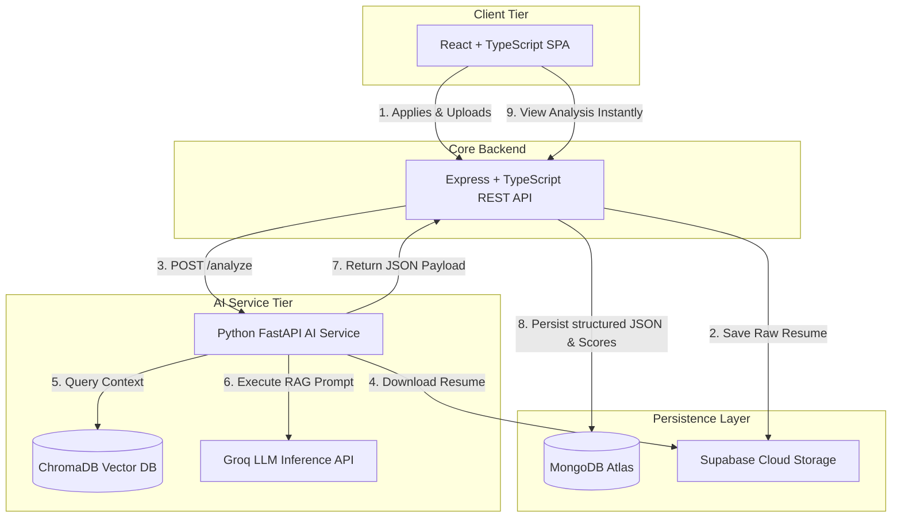
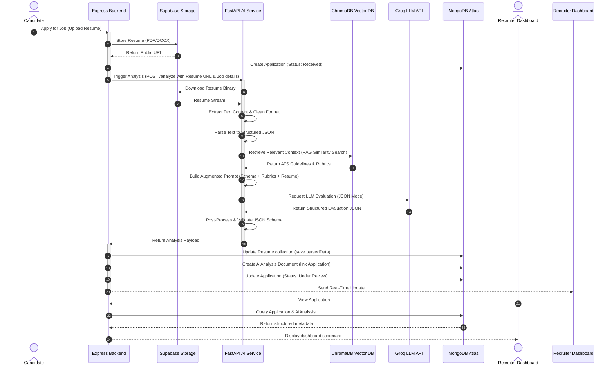
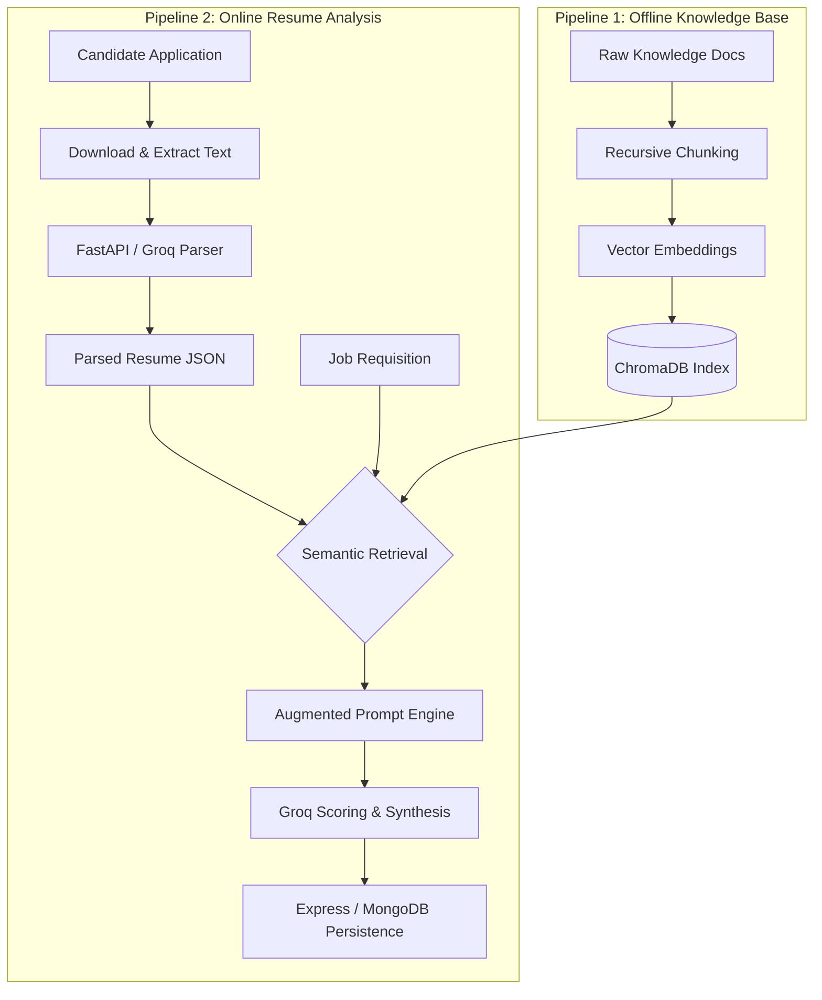
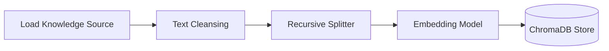
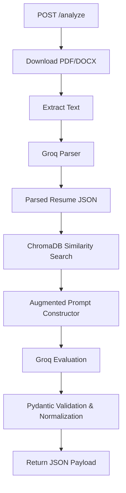
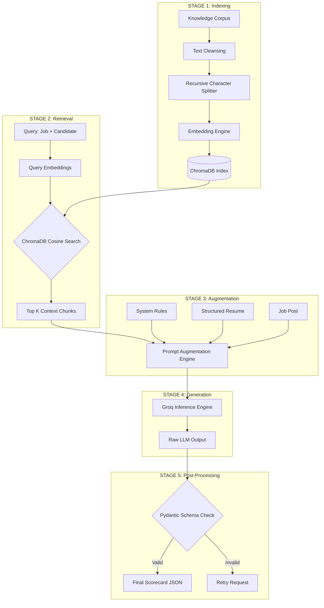
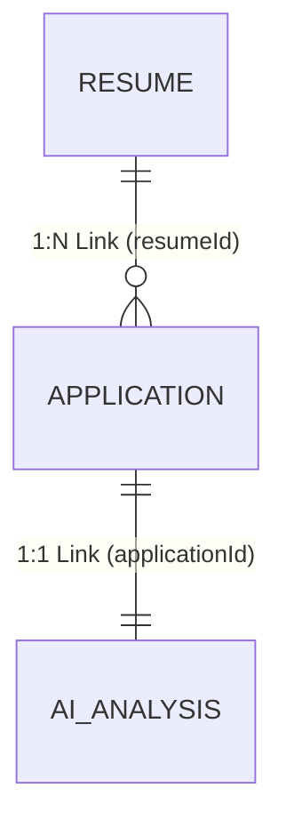

# AI Architecture

This document details the redesigned Artificial Intelligence (AI) architecture, pipeline workflows, Retrieval-Augmented Generation (RAG) system, and engineering decisions implemented inside RecruitIQ.

The AI system is designed to provide automated, objective, and consistent screening of candidate resumes against job requisitions, delivering structured evaluations directly to recruiters immediately upon application submission.

---

## 1. System Overview

RecruitIQ partitions its transactional web framework from its computationally intensive AI capabilities. The AI Service is completely independent of the core backend application, operating as a standalone microservice that exposes RESTful endpoints. 

### Decoupled Architectural Stack

The complete RecruitIQ architecture operates through the following data and processing pipeline:

### Integration Boundaries & Communication Protocols

*   **RESTful Interface:** The Express backend communicates with the Python FastAPI AI service exclusively through standard HTTP REST APIs.
*   **MongoDB Isolation:** The FastAPI AI service never connects directly to MongoDB Atlas. It remains completely stateless regarding the primary application database.
*   **Result Persistence:** The Express backend remains responsible for receiving the structured AI evaluations, updating the `Resume` collection, writing the `AIAnalysis` document, and managing state transitions.
*   **Storage Access:** The FastAPI AI service interacts with Supabase Cloud Storage via secure download URLs provided in the API trigger payload, isolating file storage access patterns.

---

## 2. End-to-End AI Workflow

The AI processing pipeline is fully automated and triggered immediately upon candidate submission. Recruiters do not need to click an "Analyze Resume" or "Process" button; evaluation occurs asynchronously in the background.

### Step-by-Step Workflow Phases

1.  **Resume Upload:** The candidate submits an application containing a resume file (PDF/DOCX) through the React frontend.
2.  **Supabase Storage:** The Express backend streams the file to Supabase Cloud Storage and receives a unique, read-only URL.
3.  **Application Creation:** Express registers the new transaction inside MongoDB, creating the `Application` document with a `Received` status.
4.  **REST Trigger:** Express sends an asynchronous HTTP POST request to the `/analyze` endpoint of the FastAPI service, passing the resume URL, job description, and job requirements.
5.  **Resume Download:** The FastAPI service fetches the raw binary file from Supabase.
6.  **Text Extraction:** The service extracts raw string contents, filtering layout wrappers, font markers, and styling artifacts.
7.  **Resume Parsing:** Using high-speed Groq inference, the unstructured text is structured into a normalized profile schema (skills, education, projects, experience, certifications, technical skills, soft skills, personal information).
8.  **RAG Context Querying:** FastAPI queries ChromaDB to locate candidate evaluations guides, ATS heuristics, and skill matrices matching the job profile.
9.  **Prompt Augmentation:** The system compiles a prompt injecting the parsed resume, job description, RAG context, evaluation rubrics, and the required JSON schema.
10. **Groq Analysis:** The model computes scores, extracts matched/missing skills, identifies strengths/weaknesses, and formulates recommendations.
11. **Post-Processing:** FastAPI validates the JSON output against a Pydantic model to guarantee schema conformity and normalizes the generated scores.
12. **Backend Delivery:** The structured JSON payload is returned to the Express API.
13. **MongoDB Synchronization:** Express updates the candidate's `Resume` record with the `parsedData`, inserts the analysis object into the `AIAnalysis` collection, and marks the application as `Under Review`.
14. **Dashboard Presentation:** The recruiter accesses the dashboard and immediately views the comprehensive evaluation scorecard.

---

## 3. The Two-Pipeline Design

RecruitIQ decouples its AI execution into two distinct pipelines. This division optimizes computational utilization and ensures runtime latency is minimized.

### Pipeline 1: Offline Knowledge Base Pipeline

This pipeline runs asynchronously and only executes when the underlying evaluation corpus is created, updated, or expanded. It is completely isolated from candidate application submissions.

*   **Inputs:** Recruiting benchmarks, ATS constraints, resume standards, domain-specific skill taxonomy matrices, and industry guidelines.
*   **Workflow:** Documents are loaded, cleaned, chunked into overlapping segments, embedded into high-dimensional vector spaces, and saved to the ChromaDB vector store.
*   **Frequency:** Executed on system startup, schedule syncs, or when administrators publish new guidelines.

### Pipeline 2: Online Resume Analysis Pipeline

This pipeline runs synchronously upon every application submission. It executes the runtime sequence of file extraction, parser structuring, context retrieval, LLM analysis, and schema verification.

*   **Inputs:** The candidate's raw resume file (from Supabase) and the specific job listing parameters.
*   **Workflow:** The runtime pipeline fetches, parses, matches, retrieves context from ChromaDB (using read-only semantic searches), requests Groq inference, and pushes data back to the core API.
*   **Frequency:** Triggered on demand per candidate application.

### Performance & Scalability Rationale

1.  **Zero Embedding Creation at Runtime:** Generating high-dimensional vector embeddings from raw corporate guidelines is computationally expensive. The offline pipeline executes this work beforehand. At runtime, only a single query embedding (based on the job description and candidate experience) is generated to run the similarity lookup, saving critical processing seconds.
2.  **Stateless Request Profiling:** The runtime pipeline executes as a collection of fast, stateless computations. ChromaDB handles concurrent vector read requests efficiently without lock contentions, allowing the FastAPI service to scale horizontally.
3.  **Context Size Limitation:** Decoupling the indexing means the system retrieves only the top-$K$ relevant guidelines (usually 3 to 5 chunks) matching the candidate's exact profile. This minimizes token usage on the Groq API call, decreasing API costs, reducing latency, and preventing model distractions.

---

## 4. Pipeline 1: Offline Knowledge Base Ingestion

The Offline Ingestion Pipeline creates the context database used to ground the LLM's evaluations.

### Knowledge Sources

*   **ATS Guidelines:** Criteria defining resume structural layout parameters (e.g., margins, font types, section headings) required for traditional parser compatibility.
*   **Recruiter Best Practices:** Standardized methods to cross-evaluate experience levels (seniority ratios), assess tenure stability, and identify career trajectory trends.
*   **Resume Writing Guides:** Conventions detailing high-impact communication strategies (e.g., metric-driven bullet points, structured descriptions).
*   **Industry Hiring Articles:** Context maps linking adjacent technologies (e.g., mapping React to Vue as Frontend, or Express to FastAPI as Backend APIs) to enable semantic skill mapping.
*   **Action Verb References:** Lexicons of action verbs (e.g., *designed*, *orchestrated*, *engineered*) linked to performance scoring.

### Indexing Workflow Steps

1.  **Load Documents:** Read raw unstructured text, markdown, and PDF assets from the system's local knowledge directory.
2.  **Clean Documents:** Strip formatting markup, normalize unicode points, and resolve carriage return variations.
3.  **Split Documents into Chunks:** Divide long documents into smaller segments using a recursive character text splitter.
    *   *Purpose of Chunking:* Breaking documents into discrete blocks ensures that embeddings represent focused semantic topics, improving search relevance.
    *   *Chunk Size:* 800 characters.
    *   *Chunk Overlap:* 80 characters (10% boundary preservation to maintain semantic context across chunks).
4.  **Generate Embeddings:** Convert each text segment into a dense, 1536-dimensional vector embedding representation using a high-density text embedding model.
    *   *Purpose of Embeddings:* High-dimensional vectors capture the mathematical semantic meaning of the text, allowing similarity search beyond simple string keyword matching.
5.  **Store Embeddings inside ChromaDB:** Write the generated vectors alongside their text and source metadata into a persistent ChromaDB collections index on disk.
    *   *Purpose of Persistent Vector Storage:* Avoids repeating expensive document loading and embedding steps. It enables sub-millisecond semantic search retrieval on structured vector collections.

*Note: Ingestion is executed offline and is NOT run during candidate resume analysis requests.*

---

## 5. Pipeline 2: Online AI Analysis Runtime

The Online Resume Analysis Pipeline executes the parsing, RAG matching, scoring, and formatting stages.

### Step 1: Resume Download
The FastAPI service downloads the document from the secure Supabase Storage URL. To minimize disk I/O overhead and prevent security concerns, the file binary is processed directly inside memory-mapped buffers. Both standard Portable Document Format (PDF) and Microsoft Word Open XML Document (DOCX) types are supported.

### Step 2: Resume Text Extraction
Specialized engines extract raw textual data:
*   **PDF Processing:** PyPDF and PDFPlumber extract plain-text characters, maintaining vertical alignment blocks where possible.
*   **DOCX Processing:** Python-docx extracts paragraph blocks and text tables sequentially.
*   **Formatting Normalization:** The system collapses multiple consecutive whitespaces, converts bullet formats to standard dashes, removes non-printable characters, and strips document header/footer patterns.

### Step 3: Resume Parsing (Structuring)
The cleaned plain text is parsed into a structured candidate profile schema. FastAPI triggers a fast Groq LLM inference pass to extract and return a valid JSON object matching the following structure:
*   **Personal Information:** Full name, email, phone number, and social links.
*   **Technical Skills:** Programming languages, frameworks, developer tools, database engines.
*   **Soft Skills:** Communication styles, management capabilities, project coordination strengths.
*   **Work Experience:** Companies, roles, tenure durations, and key responsibilities.
*   **Education:** Institutions, degrees completed, fields of study, graduation years.
*   **Projects & Certifications:** Key projects, descriptions, and credentials.

#### Separation of Parsing and Analysis
Parsing is executed as an isolated stage before evaluation. If unstructured text is sent directly to the model alongside the scoring instructions, the LLM must handle two complex cognitive operations simultaneously: organizing text fields and evaluating qualifications. This leads to reasoning drift and hallucinations. Separating the tasks ensures:
1.  The evaluation model receives a clean, structured JSON profile, improving scoring consistency.
2.  The parsed data can be validated against strict schemas before analysis.
3.  The parsed resume data is saved as a reusable asset, allowing candidates to apply to other jobs without re-running document parsing.

### Step 4: Semantic Retrieval (RAG)
Using the parsed resume skills and job requirements, FastAPI generates a semantic search query. This query searches the ChromaDB collections using cosine similarity metrics:
$$\text{Similarity}(A, B) = \frac{A \cdot B}{\|A\|\|B\|}$$
The system retrieves the Top-$K$ ($K=3$) most relevant chunks from the offline knowledge base. 
*   **Top-K Retrieval:** Restricts context to the top $K$ semantic matches to limit the LLM context size, reducing token consumption and runtime latency.
*   **Semantic Similarity Search:** Allows the system to identify related concepts and standards based on meaning, rather than relying on exact keyword matching.

### Step 5: Prompt Augmentation
The prompt builder constructs a single comprehensive prompt for the evaluation engine, containing:
1.  **System Prompt:** Defines the evaluator persona, scoring guidelines, and structural rules.
2.  **Job Requisition Parameters:** The requirements, duties, and preferences of the job description.
3.  **Parsed Resume Profile:** The structured candidate data generated in Step 3.
4.  **Retrieved Context Chunks:** Grounding guidelines extracted from ChromaDB in Step 4.
5.  **Predefined Rubrics:** Criteria defining how to rate qualifications.
6.  **Expected JSON Schema:** Constraints enforcing a valid output format.

Prompt augmentation anchors the model's logic. By explicitly matching candidate qualifications against RAG guidelines, the LLM is forced to evaluate candidates using consistent criteria, improving score objectivity and preventing bias.

### Step 6: Inference Generation
FastAPI calls the Groq API (using the Llama-3-70B model in JSON mode) to evaluate the candidate. Groq generates:
*   An executive summary of suitability.
*   Overall score and individual dimension scores (ATS, Technical, Experience, Education, Projects).
*   Lists of matched and missing skills.
*   Categorized candidate strengths and weaknesses.
*   Specific resume improvement recommendations.
*   Pre-categorized recommendations (e.g., *Strong Match*, *Good Match*, *Borderline Match*, *Unsuitable*).

### Step 7: Post-Processing & Validation
The FastAPI service validates the returned JSON payload against a strict **Pydantic** schema. If fields are missing or schema constraints are violated, the pipeline retries the request with a corrected prompt. Scores are normalized to fall within the $[0, 100]$ range.

---

## 6. RAG Architecture and Canonical Stages

RecruitIQ's Retrieval-Augmented Generation implementation relies on the five canonical RAG processing phases:

### The Five Canonical Stages

| Stage | Responsibility / Operation | RecruitIQ Implementation |
| :--- | :--- | :--- |
| **1. Indexing** | Converts offline unstructured knowledge documents into structured search indexes. | Segments recruitment guides into 800-character chunks, generates 1536-dimensional embeddings, and indexes them in ChromaDB. |
| **2. Retrieval** | Searches the vector database using query embeddings to find context segments. | Creates query vectors from job specs and candidate profiles, executing a cosine similarity lookup to find the top 3 matches. |
| **3. Augmentation** | Combines retrieved context blocks with active user parameters into a single prompt. | Injects ChromaDB matches, parsed resume structures, job requisitions, and scoring guidelines into the prompt layout. |
| **4. Generation** | Sends the augmented prompt to the LLM to generate the structured evaluation. | Executes Llama inference via Groq, enforcing output constraints using JSON mode. |
| **5. Post-Processing** | Validates, normalizes, and filters the generated response to ensure consistency. | Parses the JSON payload with Pydantic, validates required fields, normalizes scores, and returns the response. |

---

## 7. Scoring Strategy

To ensure objective evaluations, RecruitIQ evaluates candidate profiles across multiple dimensions based on predefined rubrics:

*   **ATS Score:** Evaluates resume layout readability, proper section headers, absence of complex graphic overlays, and contact details completeness.
*   **Technical Skills:** Evaluates candidate technical capabilities against the job requirements. Analyzes direct matches, semantic matches, and secondary tools.
*   **Experience:** Evaluates work history duration, role seniority levels, company size, and progressive career advancement. Deducts points for unstable tenures or structural role mismatches.
*   **Education:** Compares academic credentials (degrees, majors) against job requirements. Awarded based on academic level and field relevance.
*   **Projects:** Evaluates project descriptions, technical complexity, and alignment with job requirements.
*   **Overall Score:** A weighted average calculated using the individual dimensions.
*   **Recommendation:** An actionable hiring recommendation generated based on the overall score.

### Predefined Evaluation Rubrics
Rather than letting the LLM calculate scores arbitrarily, RecruitIQ uses explicit scoring rules:
*   *Score of 90-100:* All requirements are met, with exceeding experience or skills.
*   *Score of 75-89:* Meet all primary requirements, with minor gaps in secondary parameters.
*   *Score of 50-74:* Meet most requirements, but with gaps in primary technologies or experience.
*   *Score below 50:* Major gaps in core requirements and experience.

The overall matching score is calculated using the following weights:

$$\text{Overall Score} = (\text{Technical} \times 0.35) + (\text{Experience} \times 0.35) + (\text{ATS} \times 0.15) + (\text{Education} \times 0.15)$$

Recommendations are categorized into four types based on the overall score:
*   **Strong Match:** $\text{Overall Score} \ge 85$
*   **Good Match:** $70 \le \text{Overall Score} < 85$
*   **Borderline Match:** $50 \le \text{Overall Score} < 70$
*   **Unsuitable:** $\text{Overall Score} < 50$

---

## 8. Data Persistence

RecruitIQ splits data persistence across three dedicated MongoDB collections: `Resume`, `AIAnalysis`, and `Application`.

### 1. Resume Collection (`parsedData` field)
Stores the structured profile schema generated during the parsing stage (skills, education, projects, experience, certifications).
*   *Purpose:* Retains the normalized, extracted resume structure.
*   *Design Decision:* Storing parsed data inside the `Resume` collection decouples parsing from job-specific evaluations. This data is persistent and can be reused if the candidate applies to other jobs, saving processing time and API costs.

### 2. AIAnalysis Collection (`analysis` object)
Stores the scoring scorecard, matched/missing skills lists, strengths/weaknesses, and improvement suggestions.
*   *Purpose:* Retains the job-specific evaluation results.
*   *Design Decision:* Stored in a separate collection linked to the `Application` record via `applicationId`. Since job requirements vary, a candidate's resume will generate different scores for different jobs. Separating analysis records ensures evaluation histories remain distinct.

### 3. Application Collection (`analysis` reference)
Tracks the connection between candidate, job, resume, and the evaluation status.
*   *Purpose:* Acts as the transactional controller.
*   *Design Decision:* Storing application status and basic references separately from the detailed analysis lets the system query and list applications quickly on the recruiter dashboard, without loading large analysis text fields until requested.

---

## 9. Architectural Decisions

| Decision Area | Selected Technology | Architectural Rationale & Trade-offs |
| :--- | :--- | :--- |
| **AI Service (FastAPI)** | **Python FastAPI** | Selected for Python's ecosystem of ML, NLP, and text extraction libraries. FastAPI provides asynchronous request handling, auto-generated OpenAPI documentation, and low-latency performance. |
| **Orchestrator (Express)** | **Express.js Backend** | Acts as the primary backend orchestrator, handling authentication, RBAC, application workflows, and file uploads. Decoupling this from the AI service keeps the FastAPI service stateless and focused on pipeline execution. |
| **Resume Storage** | **Supabase Storage** | Provides S3-compatible cloud storage with CDN caching and secure token-based URL access. This decouples binary files from the databases. |
| **Metadata DB** | **MongoDB Atlas** | Document-oriented storage natively maps to nested JSON payloads, such as the parsed resume structures, without requiring complex schema mapping. |
| **Vector DB** | **ChromaDB** | An in-process, lightweight vector database that provides fast setup and persistent local storage. ChromaDB performs fast semantic similarity searches without the operational overhead of cloud-hosted alternatives. |
| **Reasoning Engine** | **Groq API** | Provides sub-second inference speeds for Llama models. Fast inference reduces candidate submission latency and API timeout risks. |
| **Parsing Separation** | **Isolated Parsing Step** | Splitting parsing (text-to-JSON) from evaluation (JSON-to-scorecard) improves scoring consistency and reduces model hallucinations. It also lets the system save and reuse parsed resume structures. |
| **Offline Ingestion** | **Pre-Indexed Knowledge Base** | Processing guidelines and writing embeddings offline keeps the runtime analysis pipeline fast, saving processing time during candidate application. |
| **AI Statelessness** | **Stateless FastAPI Service** | The FastAPI service does not maintain state or connect to MongoDB. It receives inputs, runs the analysis pipeline, and returns the result. This simplifies scaling and service boundaries. |

---

## 10. System Benefits

The redesigned RecruitIQ AI architecture delivers the following benefits:

*   **Automatic Analysis:** Resume screening runs automatically immediately after application submission, removing the need for manual recruiter triggers.
*   **No Recruiter Interventions:** Preliminary screening results are generated in the background and stored directly in the database.
*   **Reduced Latency:** Offloading text parsing and leveraging Groq's high-speed inference keeps application processing fast, reducing client API timeouts.
*   **Scalable AI Microservices:** Decoupling the AI service from the main backend protects the transactional Express API from CPU-heavy parsing workloads.
*   **Separation of Concerns:** Independent database interfaces, file management steps, and LLM routes ensure cleaner code organization.
*   **Reusable Knowledge Base:** Indexing guidelines offline allows the system to reuse the context vector database for all evaluations without re-indexing.
*   **Improved Productivity:** Recruiters can view applicant rankings and evaluations instantly on the dashboard, reducing manual screening time.
*   **Future Extensibility:** The decoupled microservice design makes it easy to update prompt templates, modify the Vector Database corpus, or switch LLM models inside the FastAPI service without affecting Express endpoints.
